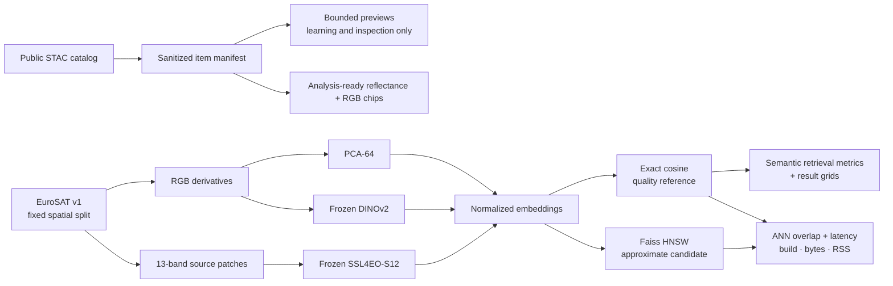

# EO Visual Retrieval

An educational Earth-observation image-retrieval system built to demonstrate the complete
retrieval workflow: public-data discovery, reproducible manifests, image embeddings, exact and
approximate ranking, and honest offline evaluation.

The project compares PCA, frozen RGB DINOv2, RGB and 13-band SSL4EO-S12, and
13-band TerraMind-Tiny features.
It provides a tested offline pipeline, command-line interface, interactive representation explorer,
and a spatially separated EuroSAT benchmark. Broader temporal and cross-dataset generalization has **not** yet been
established.

## What the project does

- Searches public Earth-observation catalogs through STAC.
- Stores stable item identities and safe metadata without signed asset URLs.
- Materializes bounded preview imagery for learning and qualitative inspection.
- Builds aligned, georeferenced Sentinel-2 reflectance and model-ready RGB chips.
- Prepares a bounded, class-balanced EuroSAT benchmark with spatial leakage controls.
- Builds deterministic index/query manifests from labeled local images.
- Generates PCA, DINOv2, or EuroSAT-specific SSL4EO-S12 image embeddings.
- Persists the fitted PCA basis so images outside the original manifest can be embedded.
- Provides an experimental pinned, frozen TerraMind-Tiny S2L1C embedding adapter.
- Ranks images with exact cosine similarity, for a stored item or a new local RGB image.
- Supports local text, image, and hybrid search with a pinned RemoteCLIP RGB/text model,
  adjustable weighting, visible prompt defaults, and strict metadata filters.
- Serves a browser comparison across prepared representations, with class filtering, provenance,
  and PCA queries from uploaded RGB chips.
- Benchmarks Faiss HNSW recall, latency, construction time, and storage against exact search.
- Reports Precision@k, Recall@k, mAP@k, and nDCG@k.
- Scores multi-label development queries with Jaccard relevance while holding final queries out.
- Audits verified BigEarthNet metadata for label, date, and official-split coverage.
- Freezes a 5,000-patch BigEarthNet acquisition selection with independently audited reference
  footprints, spatial guards, and chronological windows; S2 imagery acquisition remains pending.
- Optionally records aggregate evaluations in local MLflow without uploading imagery or vectors.
- Records the difference between executed evidence and planned work.

## System at a glance



STAC discovery and benchmark evaluation are separate on purpose. Preview assets help teach the
data-access workflow, but they are not analysis-ready chips and must not be used to support
quantitative retrieval claims.

See [Architecture](docs/architecture.md) for the components, boundaries, and design decisions.

## Explore the product surface

The [combined product](docs/product-surface.md) connects **Search**, **Compare models**,
**Findings**, and **Data & experiments**. Inspect query/filter decisions, weighted score
contributions, component ranks, model provenance and engine timing; export search records as JSON.
Findings includes the existing charts, metric definitions, sample sizes and downloadable reports.
The [research roadmap](docs/research-roadmap.md) separates proposed data and fine-tuning work
from executed experiments.

For prompt-based search, RGB uploads, selected examples, or text + image queries, use the new
[multimodal search guide](docs/multimodal-search.md). `embed-remoteclip` prepares the shared
image/text space and `serve-search` launches the local interface. Location, dates and cloud
coverage are metadata constraints; semantic similarity cannot establish urban expansion.
The model is an experimental baseline, with no prompt-relevance benchmark claim. A new
[guarded temporal diagnostic](docs/results/multimodal-temporal.md) measured RemoteCLIP image
retrieval at 41.7% top-1 versus DINOv2's 80.6% on 36 queries; model choice depends on the task.

The local explorer compares the same query across PCA, DINOv2, SSL4EO-S12 RGB, SSL4EO-S12
13-band, and TerraMind-Tiny stores. Inspect class labels, cosine scores, and model provenance,
or upload an RGB chip to search through the saved PCA projection.

Install the optional `app` extra and follow [the product surface guide](docs/product-surface.md)
for the launch command, required local artifacts, and container setup. The viewer needs no GPU
or model framework. Prepared imagery and embeddings remain outside Git.

## Are we training models?

Not the neural networks. DINOv2 and SSL4EO-S12 are pretrained by their original authors and remain
frozen here: this project loads their weights and runs inference to create embeddings. PCA is the
only representation fitted inside this project, using index images only and no class labels.
EuroSAT labels are used only after retrieval to score rankings.

Read [Understanding training, retrieval, and the benchmarks](docs/learning-benchmarks.md) for the
complete visual explanation of pretraining, fitting, inference, splitting, ranking, metrics, and
what the current evidence does and does not prove.

## Current benchmark phase

The first real evaluation uses a 2,000-image subset of the official georeferenced EuroSAT
multispectral archive: 1,600 index images and 400 queries, balanced across 10 classes. Index and
query use disjoint 50 km spatial cells and a 5 km guard band. See the
[EuroSAT benchmark guide](docs/benchmark-eurosat.md) for provenance, preparation, and limitations.

## Quick start

Python 3.11 is recommended for the complete ML stack. On Windows, use a short environment path
because PyTorch packages contain deeply nested files.

For the reproducible locked workflow, isolated CUDA setup, and local experiment tracking, follow
[Evaluation foundations](docs/evaluation-foundations.md). The pip commands below remain a simple
editable-install alternative, but do not reproduce the committed lockfile.

```powershell
py -3.11 -m venv C:\Users\<you>\.venvs\eovr
C:\Users\<you>\.venvs\eovr\Scripts\python -m pip install --upgrade pip
C:\Users\<you>\.venvs\eovr\Scripts\python -m pip install -e ".[dev,app,stac,geo,ml,search,bigearthnet]"
```

Confirm the local code is healthy:

```powershell
C:\Users\<you>\.venvs\eovr\Scripts\python -m ruff check .
C:\Users\<you>\.venvs\eovr\Scripts\python -m mypy
C:\Users\<you>\.venvs\eovr\Scripts\python -m pytest
```

## EO chip workflow

Search for one or more public Sentinel-2 items:

```powershell
eovr stac-search `
  --api-url https://planetarycomputer.microsoft.com/api/stac/v1 `
  --collection sentinel-2-l2a `
  --bbox -122.2751 47.5469 -121.9613 47.7458 `
  --datetime 2024-06-01/2024-06-30 `
  --max-cloud-cover 20 `
  --limit 20 `
  --output data/manifests/stac-items.jsonl
```

Select one item ID from that sanitized manifest and materialize a bounded spatial window:

```powershell
eovr stac-chip `
  --manifest data/manifests/stac-items.jsonl `
  --item-id <stable-stac-item-id> `
  --bbox -122.15 47.60 -122.13 47.62 `
  --output-dir data/stac-chips `
  --image-manifest data/manifests/stac-chip.jsonl `
  --signer planetary-computer
```

The command produces a float32 BOA-reflectance GeoTIFF and a fixed-stretch uint8 RGB GeoTIFF. The
image manifest points to the RGB artifact used by the embedding pipeline and records the
reflectance artifact, grid, mask policy, processing baseline, and hashes.

## Retrieval workflow

Organize labeled RGB images by class:

```text
data/images/
  forest/
  harbor/
  residential/
```

Build a deterministic manifest:

```powershell
eovr manifest-build `
  --images data/images `
  --output data/manifests/images.jsonl
```

Generate the two generic RGB embedding baselines:

```powershell
eovr embed-pca `
  --manifest data/manifests/images.jsonl `
  --image-root data/images `
  --components 64 `
  --output artifacts/pca-64.npz `
  --projection-output artifacts/pca-64-projection.npz

eovr embed-dinov2 `
  --manifest data/manifests/images.jsonl `
  --image-root data/images `
  --output artifacts/dinov2-vits14.npz
```

Evaluate and inspect results:

```powershell
eovr evaluate --embeddings artifacts/dinov2-vits14.npz --k 10
eovr query --embeddings artifacts/dinov2-vits14.npz --item-id forest/example.jpg --k 5
eovr query --embeddings artifacts/dinov2-vits14.npz --image data/incoming/unseen.png --k 5
```

The last form embeds an image the corpus has never seen, using the backend recorded in the
store. The multispectral backends refuse it, because they read 13-band archive members rather
than RGB files.

The full data-discovery and retrieval procedure is explained in
[Pipeline and CLI](docs/pipeline-and-cli.md).

## Current evidence

The verified code-health gates — lint, type checking, and tests — pass on Python 3.11, and CI
tests Python 3.11 and 3.12 on Linux and Windows. Bounded STAC and analysis-ready chip smoke runs
have executed successfully. The EuroSAT v1 benchmark uses
1,600 index images and 400 queries with disjoint 50 km spatial cells and a 5 km guard band.

At `k=10`, PCA-64 achieved mAP 0.19698, DINOv2 ViT-S/14 achieved 0.60763, and 13-band
SSL4EO-S12 achieved 0.81360 on the same selected patches, split, relevance definition, and exact
ranker. See [EuroSAT v1 results](docs/results/eurosat-v1.md) for all metrics, per-class slices,
qualitative examples, reproducibility evidence, and limitations.

The newer TerraMind-Tiny challenger achieved mAP@10 0.68688 on the same EuroSAT regression set:
above DINOv2 but below SSL4EO, which remains the selected multispectral reference. See
[TerraMind v1 results](docs/results/terramind-v1.md). A bounded 40-sample SSL4EO CPU/CUDA agreement
check also passed; representative GPU throughput has not been established.

The Faiss v1 experiment found that exact search remains the best default for the real 1,600-item
corpus. On a 50k synthetic DINOv2 scaling workload, HNSW at `efSearch=16` was 2.06× faster but
retained 85.2% of the exact top-10 neighbors; raising recall to 97.6% removed the speed advantage.
See [Faiss v1 results](docs/results/faiss-v1.md) for the complete matrix and evidence limits.

See [Validation](docs/validation.md) for exact evidence and limitations.

## Documentation

Start with the [checkpoint review](docs/project-review.md) for current findings, applied fixes,
the technology stack, third-party options, and remaining work.

Read the guides in this order:

1. [Project context and roadmap](docs/project-context.md) — goal, current state, and next work.
2. [Understanding the benchmarks](docs/learning-benchmarks.md) — training, frozen models, splits, metrics, and evidence.
3. [Architecture](docs/architecture.md) — components, data boundaries, and design choices.
4. [EuroSAT benchmark](docs/benchmark-eurosat.md) — dataset, split, commands, and limits.
5. [EuroSAT v1 results](docs/results/eurosat-v1.md) — semantic metrics, examples, and interpretation.
6. [Faiss benchmark](docs/benchmark-faiss.md) — exact/ANN concepts, protocol, commands, and metrics.
7. [Faiss v1 results](docs/results/faiss-v1.md) — executed scale matrix and current index decision.
8. [Pipeline and CLI](docs/pipeline-and-cli.md) — each action, input, and output.
9. [Models and metrics](docs/models-and-metrics.md) — representations and both recall definitions.
10. [Architecture decisions](docs/decisions/) — alternatives, decisions, trade-offs, and risks.
11. [Learning STAC](docs/learning-stac.md) — EO catalog concepts and retrieval pitfalls.
12. [Development](docs/development.md) — environment, tools, tests, and contribution workflow.
13. [Validation](docs/validation.md) — what has and has not been verified.
14. [Evaluation foundations](docs/evaluation-foundations.md) — locked environments, GPU checks, model-selection gates, and local tracking.
15. [TerraMind experiment](docs/benchmark-terramind.md) and [results](docs/results/terramind-v1.md) — frozen-model contract, executed comparison, and retained SSL4EO decision.
16. [BigEarthNet acquisition and evaluation](docs/benchmark-bigearthnet.md) — source inventory, SSL4EO compatibility gate, and multi-label development scoring.
17. [BigEarthNet S2 streaming](docs/bigearthnet-streaming.md) — single-pass staging, inline geometry checks, interruption recovery, and throughput evidence.

18. [Product surface](docs/product-surface.md) — interactive comparison, local launch, upload behavior, and container status.

## Data and privacy policy

- Do not commit EO imagery, generated embeddings, credentials, or signed URLs.
- Do not commit private areas of interest or proprietary data.
- Keep local data under `data/` and generated vectors under `artifacts/`; both are ignored.
- Persist stable STAC identities and allowlisted metadata only.
- Use public, generic examples and sanitized aggregate results in documentation.

## Roadmap

The locked-environment, local-tracking, GPU-parity, and frozen TerraMind regression gates have now
executed. Measurement then established that EuroSAT cannot supply a confirmatory holdout: preparing
v1 consumed 725 of its 845 fifty-kilometre cells, leaving one class with no untouched patches.
EuroSAT v1 is permanently a regression benchmark, and BigEarthNet v2 is the specified confirmatory
set. Its downloader is implemented, but the full acquisition remains paused. The EuroSAT product
surface works locally; hosting is the next deployment decision. Exact search remains the default; Qdrant is the first future product-store experiment, and
Milvus is deferred until scale evidence justifies it. See
[ADR 0005](docs/decisions/0005-evaluation-foundations-before-product.md) and
[ADR 0006](docs/decisions/0006-confirmatory-evaluation-data.md).

## License

[MIT](LICENSE.md)
