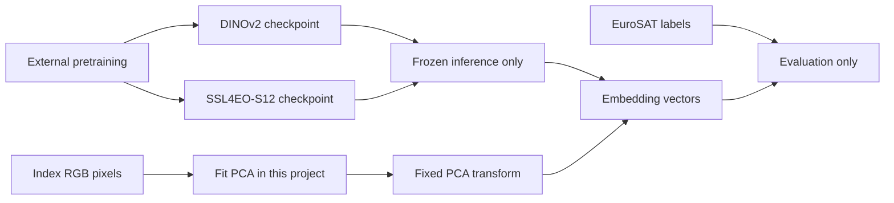

# Architecture

## Purpose

EO Visual Retrieval is an offline reference system for learning how image-retrieval systems are
built and evaluated. It separates data acquisition, representation, ranking, and evaluation so
that each stage can be inspected and changed independently.

The current system is deliberately small:

- files and JSONL manifests instead of a database;
- compressed NumPy arrays instead of a vector service;
- exact cosine search as the default plus an isolated Faiss HNSW benchmark path;
- a command-line interface and an optional FastAPI comparison surface over local stores.

Those choices keep the quality baseline understandable before scale-oriented components are added.

## High-level design

```mermaid
flowchart TD
    subgraph Acquisition[Public data acquisition]
        STAC[STAC API] --> Items[Sanitized StacItemRecord JSONL]
        Items --> Preview[Bounded preview]
        Items --> Chip[Aligned reflectance + RGB chip]
    end

    subgraph Benchmark[Retrieval benchmark]
        Manifest[Selected EO patches + ImageRecord JSONL] --> RGB[RGB files]
        Manifest --> MS[13-band source archive]
        MS --> TM[Frozen TerraMind-Tiny<br/>experimental challenger]
        RGB --> PCA[PCA]
        RGB --> DINO[Frozen DINOv2]
        MS --> SSL[Frozen SSL4EO-S12]
        PCA --> Store[EmbeddingStore NPZ]
        DINO --> Store
        SSL --> Store
        TM --> Store
        Store --> Exact[Exact cosine / Faiss Flat<br/>quality reference]
        Store --> HNSW[Faiss HNSW<br/>approximate experiment]
        Store --> Evaluator[Offline evaluator]
        Exact --> Rankings[Ranked item IDs]
        Exact --> SearchEval[ANN recall + systems cost]
        HNSW --> SearchEval
        Evaluator --> Metrics[P@k · R@k · mAP@k · nDCG@k]
    end
```

The acquisition and retrieval paths meet at local image files, not at provider URLs. This is the
main security and reproducibility boundary.

## Learning and training boundary



No neural-network weights are updated in this repository. PCA is fitted on index pixels only,
without class labels. See [Understanding the benchmarks](learning-benchmarks.md) for the complete
learning-oriented explanation.

## Components

| Component | Responsibility | Main module |
|---|---|---|
| Content digests | Produce one streaming SHA-256/MD5 identity for every artifact | `hashing.py` |
| Vector preparation | Enforce finite, unit-length rows before any cosine comparison | `vectors.py` |
| EuroSAT dataset identity | Hold the archive checksum, band order, and member access | `datasets/eurosat.py` |
| BigEarthNet dataset identity | Pin source/checksums and bound metadata-only acquisition | `datasets/bigearthnet.py` |
| BigEarthNet metadata audit | Verify local Parquet inputs and measure label/date/grid coverage without selecting partitions | `datasets/bigearthnet_audit.py` |
| BigEarthNet footprint inventory | Bound and verify the reference archive; stream TIFF headers into compact local Parquet | `datasets/bigearthnet_footprints.py` |
| BigEarthNet acquisition selection | Select IDs using fixed date/cell/label rules; independently audit fresh source geometry | `benchmarks/bigearthnet_partitions.py` |
| STAC search | Validate a bounded query and collect safe item metadata | `stac.py` |
| Preview materializer | Resolve an item, optionally sign in memory, and download a bounded image | `stac.py` |
| Sentinel-2 chip builder | Align band windows, scale reflectance, apply SCL masks, and write georeferenced artifacts | `chips.py` |
| EuroSAT benchmark builder | Verify provenance, group geography, enforce separation, and produce model-ready RGB inputs | `benchmarks/eurosat.py` |
| Image manifest builder | Hash images, infer labels, and assign deterministic splits | `manifests.py` |
| PCA backend | Learn a classical index-fitted projection and produce normalized vectors | `embeddings/pca.py` |
| DINOv2 backend | Produce normalized frozen vision-transformer features | `embeddings/dinov2.py` |
| SSL4EO-S12 backend | Read selected 13-band archive members and produce normalized frozen EO features | `embeddings/ssl4eo.py` |
| TerraMind-Tiny experiment | Strictly load a pinned frozen encoder and pool S2L1C patch features | `embeddings/terramind.py` |
| PCA projection | Persist the fitted basis so unseen images enter the same space | `embeddings/projection.py` |
| Query encoder | Embed one new image with the backend recorded in a store | `embeddings/encode.py` |
| Embedding store | Save vectors and retrieval metadata in a portable NPZ file | `embeddings/store.py` |
| Exact index | Rank every index vector by cosine similarity | `retrieval.py` |
| Faiss benchmark | Compare exact normalized inner product with HNSW at fixed scale tiers | `faiss_benchmark.py` |
| Evaluator | Calculate label-proxy ranked-retrieval metrics | `evaluation.py` |
| Multi-label relevance manifest | Bind label sets and index/development/final partitions to an image-manifest hash | `relevance.py` |
| Multi-label development evaluator | Score binary and graded Jaccard relevance while excluding final queries | `evaluation_multilabel.py` |
| Local experiment tracker | Opt-in aggregate metrics/content hashes to local MLflow SQLite | `tracking.py` |
| Result-grid renderer | Select per-class best/worst queries and render exact ranked results | `visualization.py` |
| Served catalog | Rank one query with several representations and report their provenance | `app/catalog.py` |
| Comparison surface | Route, render, and bound uploads before parsing; serve responsive assets | `app/main.py`, `app/static/` |
| CLI | Validate arguments and connect all stages | `cli.py` |

## Data contracts

### STAC item manifest

`StacItemRecord` describes where public imagery came from without storing an access URL. It
contains:

- STAC API and collection identity;
- stable item ID;
- bounding box and acquisition time;
- available asset keys;
- a small allowlist of EO properties.

Asset HREFs are excluded because providers may add expiring signatures or credentials. At
materialization time, the item is fetched again by stable identity and any signed URL remains in
memory.

### Image manifest

`ImageRecord` describes a local file that can be embedded:

- `item_id`: stable identifier used in results;
- `path`: path relative to the image root;
- `split`: `index` or `query`;
- `label`: optional relevance proxy;
- `source`: origin category such as `local` or `stac-preview`;
- `metadata`: content hash or sanitized source metadata.

The first folder below the image root becomes the class label. Exact duplicate content is kept in
one split, and conflicting labels for identical content are rejected.

For the EuroSAT multispectral experiment, the same record also carries its stable
`archive_member`. The SSL4EO-S12 backend reads that member directly from the verified source ZIP;
it does not create or persist a duplicate multispectral dataset. RGB paths remain useful for PCA,
DINOv2, and human-readable result grids.

Benchmark-specific builders may add stronger invariants. EuroSAT records include source
georeferencing and a global equal-area spatial group. Its builder prevents groups from crossing
the split and enforces a metric guard band between query and index centroids.

### Embedding store

`EmbeddingStore` packages:

- ordered item IDs;
- a two-dimensional float32 vector matrix;
- labels and splits aligned with the vectors;
- backend configuration metadata.

The compressed NPZ format is portable and sufficient for offline experiments. It is not intended
as a scalable online index format.

## Required invariants

Multi-label judgments live in a separate relevance manifest rather than changing the existing
embedding-store format. Its IDs cover the store exactly and its source image-manifest hash must
match the store's provenance. `development` and `final` both map to the store's `query` split,
but the multi-label evaluator selects only `development`. Final vectors are not normalized or
scored in this path. See [the BigEarthNet guide](benchmark-bigearthnet.md) for the contract.

The system depends on the following rules:

0. Shared facts have one implementation. Content digests, vector normalization, and dataset
   identity live in leaf modules; a representation never imports a benchmark. This is
   enforced by `tests/test_architecture.py`, because a second copy of a digest or a
   normalization rule is how an index and its queries silently stop agreeing.
1. Signed or credential-bearing URLs are never persisted.
2. STAC queries and downloads are bounded.
3. Learned preprocessing is fitted on index/training data only.
4. Every embedding row stays aligned with its ID, label, and split.
5. Stored IDs are unique.
6. Zero-length vectors are rejected before cosine search.
7. The query image is excluded when it also exists in the index.
8. Benchmark claims use leakage-aware splits and recorded configuration.
9. Exact search remains available as the reference for approximate-search experiments.
10. A new image is embedded by the same backend and preprocessing that produced the store it
    is compared against, or it is refused.

## Why two manifests exist

A STAC item and a retrieval image are not the same concept:

- A STAC item may expose many assets, bands, resolutions, and projections.
- A retrieval image is one concrete local tensor-ready input with a label and split.

Combining them too early would make provider access details part of model and evaluation code. The
two-manifest design lets the Sentinel-2 chip builder turn stable STAC identities into controlled
image inputs without changing the retrieval layer.

## Sentinel-2 chip contract

The chip builder uses `B04`, `B03`, and `B02` as red, green, and blue. The 10 m red band defines the
output grid. Rasterio aligns spectral bands with bilinear resampling and the categorical 20 m SCL
layer with nearest-neighbour resampling.

For processing baselines 04.00 and newer, BOA reflectance is calculated as:

```text
reflectance = DN * 0.0001 - 0.1
```

Earlier baselines use the same scale without the offset. DN zero is always treated as nodata.

The builder produces:

- float32 BOA reflectance, preserving physical values and negative dark-surface values;
- uint8 RGB using a fixed recorded reflectance range, currently 0.0–0.3 by default;
- a shared dataset mask for nodata, defective pixels, cloud shadow, low/medium/high cloud,
  cirrus, and snow/ice SCL classes;
- sanitized manifest metadata containing source identity, grid, processing parameters, and hashes.

The byte RGB file is the model input. It does not replace the reflectance artifact.

## Current limitations

- Preview records are unlabeled and assigned to the index, so they cannot form a benchmark alone.
- Chip materialization currently processes one item and one WGS84 bounding box per command.
- Deterministic content-hash splitting prevents exact duplicate leakage but not geographic or
  temporal leakage.
- Query-by-new-image works for the RGB backends only. The multispectral encoders read 13-band
  members from a verified archive, so they refuse an RGB upload rather than approximating one.
- The PCA basis is saved only when `embed-pca --projection-output` is given; a store produced
  without it can still be queried by item ID, but not with a new image.
- Exact search is intentionally linear in corpus size.
- HNSW is benchmarked but is not the current default query path.
- The interactive viewer serves precomputed vectors only. There is still no serving database or
  job runner, and uploads are embedded with PCA alone, because the other representations would
  require a model framework in the served process.
  Optional local MLflow SQLite stores experiment metrics, not the serving corpus.

These constraints define the roadmap rather than hidden production claims.
