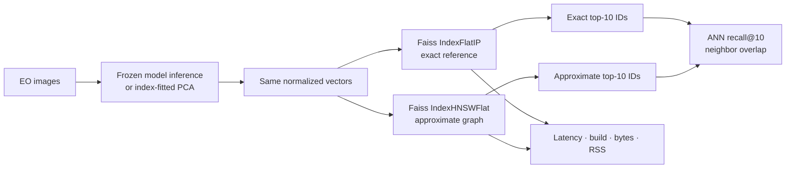
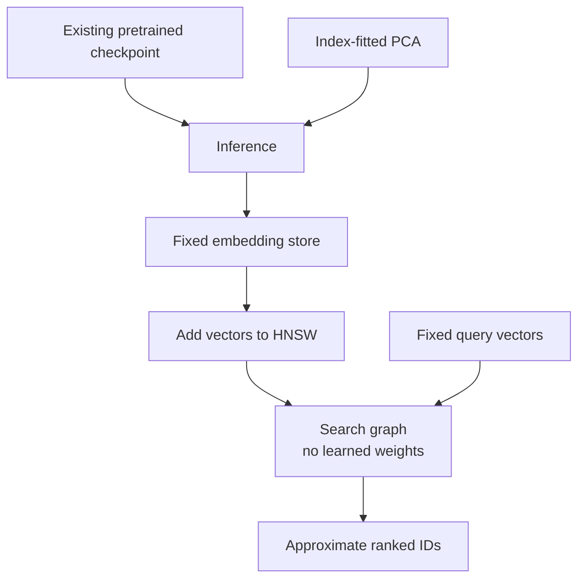

# Exact versus approximate search benchmark

## Why this benchmark exists

The EuroSAT benchmark answers, “Are the returned images semantically relevant under our class
proxy?” This benchmark answers a different systems question:

> How much of the exact top-k ranking does HNSW preserve, and what latency, build-time, size, and
> memory trade-offs does it make?

The two evaluations must not be mixed. A representation can have strong semantic mAP and an ANN
index can still lose some of its exact neighbors. Conversely, perfect ANN recall only means the
approximate ranker copied the exact ranker; it does not prove that either ranking is useful.



## Is this training?

No model parameters change. DINOv2 and SSL4EO-S12 remain frozen, and PCA is not refitted.

HNSW **constructs an index** by connecting vectors in a graph. This is preprocessing for search,
not neural-network training and not supervised learning. The distinction matters:



## Metrics

| Measurement | Definition | What it does not mean |
|---|---|---|
| ANN recall@k | Mean fraction of exact top-k IDs also returned by HNSW | Class-label Recall@k or user relevance |
| Median latency/query | Median repeated full-batch duration divided by 400 queries | Single-request service latency under load |
| p95 latency/query | 95th percentile across repeated batch-derived samples | A production tail-latency SLA |
| Build time | Time to create and add vectors to the index | Model training time |
| Serialized size | Bytes produced by Faiss index serialization | Total application or service storage |
| RSS delta | Process RSS after build minus before build | Precise index heap allocation |

ANN recall at `k=10` is:

```text
for each query: |exact top-10 IDs ∩ HNSW top-10 IDs| / 10
then average across all queries
```

## Fixed protocol

| Setting | Value |
|---|---|
| Exact reference | `IndexFlatIP` |
| Approximate candidate | `IndexHNSWFlat` |
| Similarity | Inner product after L2 normalization, equivalent to cosine ranking |
| `k` | 10 |
| `M` | 32 |
| `efConstruction` | 200 |
| `efSearch` | 16, 32, 64, 128 |
| CPU threads | 1 |
| Warmups / repeats | 2 / 7 |
| Queries | All 400 fixed EuroSAT v1 query embeddings |
| Real corpus | 1,600 index vectors for PCA, DINOv2, and SSL4EO-S12 |
| Scaling corpora | 10k and 50k deterministic DINOv2 synthetic expansions |

One thread makes local runs easier to compare and avoids hiding behavior behind machine-specific
parallelism. It does not predict a multithreaded service.

## Synthetic scaling boundary

The real DINOv2 index has 1,600 rows. For the 10k and 50k systems tests, the benchmark cycles
through those rows, adds seeded Gaussian noise with standard deviation `0.01` per dimension, and
renormalizes each new row. The original 1,600 vectors remain unchanged.

This creates a deterministic workload with the correct dimension and local neighborhoods. It does
not create new satellite observations, labels, geographic diversity, or evidence of semantic
generalization.

## Run it

Install the search dependencies:

```powershell
python -m pip install -e ".[search]"
```

Run the real DINOv2 tier:

```powershell
eovr benchmark-faiss `
  --embeddings artifacts/eurosat-v1-dinov2-vits14.npz `
  --output docs/results/faiss-v1-dinov2-1600.json `
  --corpus-size 1600 `
  --k 10 `
  --m 32 `
  --ef-construction 200 `
  --ef-search 16 32 64 128 `
  --threads 1 `
  --warmups 2 `
  --repeats 7
```

Change only `--corpus-size` and output name for a scaling tier. When the requested size exceeds
the real index count, the output marks `synthetic_expansion: true` and records the seed, noise,
and synthetic-row count.

The CLI writes JSON atomically and records embedding-store SHA-256, embedding metadata, dimensions,
counts, full index configuration, package versions, OS, Python, latency samples summary, build
measurements, and interpretation notes.

## Read the outcome

See [executed Faiss v1 results](results/faiss-v1.md). The current decision is to keep exact search
for the 1,600-vector application because HNSW usually costs more latency and always costs more
build work and serialized space at that scale. The 50k synthetic tier demonstrates a real
speed/recall exchange, but it does not yet justify changing the current product default.

