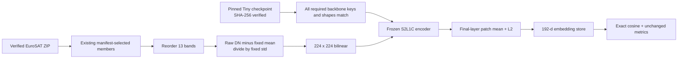

# TerraMind-Tiny: frozen S2L1C regression experiment

## Question and evidence boundary

Does a newer EO-native transformer provide useful frozen image-retrieval features on the same
selected patches as SSL4EO-S12? This is a registered **EuroSAT v1 regression experiment**, not
an independent final test or proof that a newer model is better.

The encoder is pretrained externally. This project does not train or fine-tune it. It uses no
class labels for embedding generation, no generated modalities, and no coordinate/time inputs.
The model does not replace SSL4EO-S12 by virtue of being installed.

## Fixed protocol

| Choice | Value |
|---|---|
| Model | `terramind_v1_tiny`, 192-dimensional hidden features |
| Input | Same 2,000 EuroSAT v1 archive members, 13 Sentinel-2 L1C bands |
| Split | Same 1,600 index / 400 query, 50 km groups, 5 km guard |
| Radiometry | Raw digital numbers, reordered, standardized with published v1 S2L1C mean/std |
| Spatial transform | Bilinear antialiased resize from 64 to 224 pixels, no random augmentation |
| Feature | Mean over 196 final normalized-layer patch tokens, then L2 normalization |
| Inference | Frozen weights, evaluation/inference mode, float32, default batch size 2 |
| Retrieval | Exact cosine at k=10, unchanged label-proxy relevance |
| Selection role | Regression/development only; fresh data required for final confirmation |

Unlike SSL4EO's preprocessing, TerraMind's fixed statistics are in digital-number units. Do not
divide by 10,000 first. The source archive stores `B8A` last; the adapter moves it between `B08`
and `B09`. The output metadata records the actual mean/std arrays, band order, pooling, package
versions, manifest hash, device, and checkpoint hash.



The original checkpoint also contains decoder and unused modality parameters. Dropping those
unused parameters is intentional. Missing or shape-mismatched **required backbone** parameters
are errors: the adapter never silently substitutes randomly initialized weights.

## Checkpoint identity

- Repository: `ibm-esa-geospatial/TerraMind-1.0-tiny`
- Revision: `2b5ac0a3ed7dd7e922ccfd595b56607f342df343`
- Filename: `TerraMind_v1_tiny.pt`
- Published bytes: `211873402`
- SHA-256: `e56ea9ebcd4451078b9ca4893d5cd8a89bbee376ae16829c3e7fbbbc76de0eba`

The checkpoint is public and does not require a Hugging Face login. The optional Hugging Face
plugin is useful for discovery; reproducibility depends on revision/hash pinning, not the plugin.
Download with the Hub client from the isolated foundation environment:

```powershell
python -c "from huggingface_hub import hf_hub_download; hf_hub_download(repo_id='ibm-esa-geospatial/TerraMind-1.0-tiny', filename='TerraMind_v1_tiny.pt', revision='2b5ac0a3ed7dd7e922ccfd595b56607f342df343', local_dir='data/models')"
```

The adapter verifies the checksum before deserialization with `weights_only=True`. Keep the
checkpoint under ignored `data/models`; never commit it.

## Run

Use the isolated locked environment from [Evaluation foundations](evaluation-foundations.md).
The CLI only reads local files and never initiates a checkpoint or dataset download.

```powershell
eovr embed-terramind `
  --manifest data/eurosat-v1/manifest.jsonl `
  --archive data/downloads/EuroSAT_MS.zip `
  --checkpoint data/models/TerraMind_v1_tiny.pt `
  --output artifacts/eurosat-v1-terramind-tiny.npz `
  --batch-size 2 --device cuda

eovr evaluate `
  --embeddings artifacts/eurosat-v1-terramind-tiny.npz `
  --k 10 --output outputs/terramind-regression.json `
  --tracking-dir outputs/tracking
```

Use `--device cpu` for a CPU experiment; do not imply that the two runtimes have been validated
until executed evidence is recorded. Changing precision, pooling, image size, or normalization
creates a new experiment and must not overwrite the original result.

Before reporting quality, verify ID/label/split alignment with all prior stores, finite unit
vectors, skipped-query counts, and per-class/qualitative failure cases. Results belong in
[validation](validation.md) only after execution.

## Limitations and references

The experiment changes architecture, pretraining, normalization, spatial transform, and embedding
dimension relative to SSL4EO. It is not a controlled architecture or band ablation. EuroSAT v1
has already informed model selection, lacks acquisition timestamps, and may overlap unknown
foundation-model pretraining geography. Do not claim independent generalization.

- [Official TerraMind project](https://github.com/IBM/terramind)
- [Tiny model card](https://huggingface.co/ibm-esa-geospatial/TerraMind-1.0-tiny)
- [TerraTorch implementation and normalization](https://github.com/terrastackai/terratorch/tree/main/terratorch/models/backbones/terramind)
- [ADR 0005](decisions/0005-evaluation-foundations-before-product.md)
