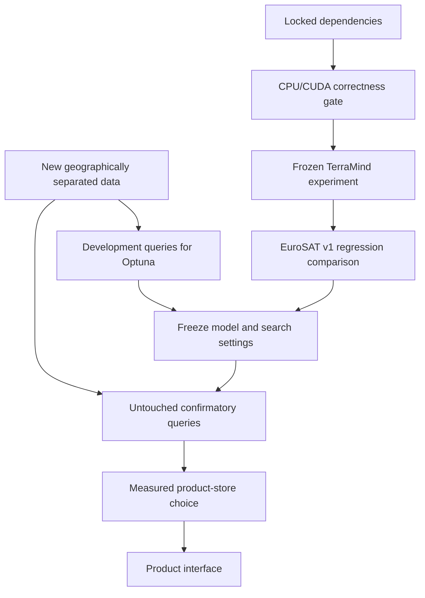

# ADR 0005: Strengthen evaluation foundations before the product interface

- Status: accepted
- Date: 2026-09-02
- Decision owners: project maintainers

## Context

The existing EuroSAT and Faiss evidence is useful but bounded. The user requested current-model
and tooling research before interface development, then authorized implementation. We need better
reproducibility, usable GPU inference, traceable experiments, and a wider evaluation protocol.
We do not need every available service or a larger operations stack at 1,600 index vectors.

The development host runs Windows with a 4 GB NVIDIA GPU. The original benchmark environment is
CPU-only. Its recorded results must remain reproducible and must not be overwritten by upgrades.

## Decision

1. Adopt `uv.lock` and locked CI on Python 3.11/3.12, Linux and Windows. Keep optional dependency
   groups so ordinary tests do not install neural networks or experiment services.
2. Preserve the original CPU environment. Create separate short-path GPU and validation
   environments. Initially retain the PyTorch 2.13 / torchvision 0.28 generation to limit change.
3. Use explicit, mutually exclusive `cpu` and `cuda` extras for official PyTorch wheel indexes.
   Pin the CUDA runtime family to 13.0; do not silently switch accelerator builds during sync.
4. Add opt-in **local** MLflow evaluation tracking. Record aggregate metrics and content hashes,
   never images, vectors, arbitrary metadata, or signed URLs. No cloud tracking or autologging.
5. Select frozen TerraMind-Tiny as the next model experiment, not as the new winner. Preserve
   SSL4EO-S12 as the current verified multispectral reference.
6. Select Optuna for future development-only parameter search. Installing it does not authorize
   tuning on the final test data, and does not constitute an executed optimization benchmark.
7. Keep exact cosine/Faiss as the reference and current default. Qdrant is the first future product
   store candidate. Milvus is a comparative scale candidate, not an immediate replacement.
8. Defer paid infrastructure and bulk BigEarthNet acquisition until a bounded data/compute plan
   specifies provenance, storage, geographic separation, and a cost ceiling.

## Options considered

| Option | Complexity / cost | Scale | Assessment |
|---|---|---|---|
| Continue unlocked pip + CPU only | Low initial cost | Current workload | Fastest now, weaker reproducibility and unused GPU |
| Locked local tools + isolated GPU | Moderate setup, no service bill | Bounded model experiments | Selected; preserves evidence and limits operational scope |
| Managed GPU + vector DB immediately | Accounts, secrets, ongoing bill | High potential | Deferred until a measured need justifies the cost |
| Install every model/database | High dependency and maintenance cost | Unclear | Rejected; more components do not establish higher quality |

### Vector-store decision

| Candidate | Strength | Consequence |
|---|---|---|
| Faiss + local artifacts | Existing exact oracle, no service | Keep; not a concurrent product database |
| Qdrant | Geo/metadata filtering, named vectors, staged search | First adapter experiment, local Docker initially |
| Milvus / Zilliz | Multi-vector and scale-oriented operation | Test when the workload warrants the extra service scope |
| LanceDB | Embedded persistence | Alternative if zero-service deployment is the primary requirement |
| Supabase / pgvector | Auth, SQL, PostGIS, API | Consider with product requirements; 2,048-d SSL4EO needs validated halfvec or reduction |

No database is accepted as faster or more accurate without an identical-vector conformance and
latency test. Exact top-k overlap, filters, ingest, cold/warm latency, memory, disk, and reload
behavior are separate acceptance dimensions.

## Benchmark integrity: a correction to the initial research plan

All 400 EuroSAT v1 queries have already influenced project decisions. Subdividing them now does
**not** create an untouched final holdout. EuroSAT v1 remains a frozen regression/development
benchmark. Use genuinely new, geographically separated data for confirmatory model selection.
Prevent temporal leakage where timestamps exist; never imply that missing EuroSAT timestamps
have been reconstructed. Audit possible overlap with foundation-model pretraining data separately.

## Consequences

- A lockfile improves dependency reproduction, but it does not pin datasets, checkpoints, or
  Torch Hub source revisions. Those identities still need explicit provenance.
- The optional foundation stack is much heavier than core CI. Native package compatibility is
  validated separately; the lock may select different compatible releases on Python 3.11/3.12.
- MLflow records are ignored local artifacts. Documentation remains the public evidence source.
- No new account is needed for the selected local tools or public TerraMind checkpoint. Gated
  DINOv3, hosted databases, and paid GPU services remain optional later choices.
- Model quality, ANN approximation quality, and service usability must not be collapsed into one
  unsupported claim of being the best tool.

## Action items

- [x] Validate locked environments and GPU parity; record only executed outcomes in validation.
- [x] Add a reproducible frozen TerraMind input/checkpoint contract and regression comparison.
  Observed mAP@10 0.68688 did not beat SSL4EO's 0.81360; retain SSL4EO as the reference.
- [ ] Specify and acquire a bounded new dataset with development/final partitions.
- [ ] Run Optuna only on development inputs, then freeze configuration.
- [ ] Test a Qdrant adapter against exact search before selecting a product database.

## Primary references

- [uv PyTorch integration](https://docs.astral.sh/uv/guides/integration/pytorch/)
- [uv Dependabot integration](https://docs.astral.sh/uv/guides/integration/dependabot/)
- [MLflow tracking](https://mlflow.org/docs/latest/ml/tracking/)
- [Optuna](https://github.com/optuna/optuna)
- [TerraMind](https://github.com/IBM/terramind)
- [BigEarthNet](https://bigearth.net/)
- [Qdrant filtering](https://qdrant.tech/documentation/concepts/filtering/)
- [Milvus geometry](https://milvus.io/docs/geometry-field.md)
- [pgvector dimensions and index types](https://github.com/pgvector/pgvector)
