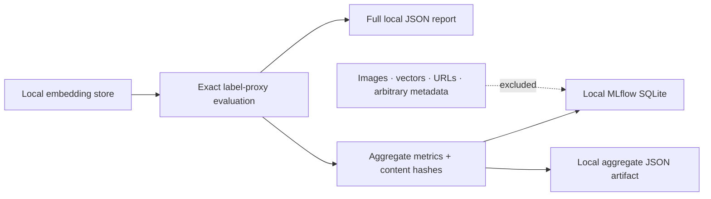

# Evaluation foundations: decisions, setup, and next gates

These foundations were established before the product interface, which is now implemented locally.
Read the [product guide](product-surface.md) for serving and
[ADR 0005](decisions/0005-evaluation-foundations-before-product.md) for the choices and
[validation](validation.md) for executed evidence. A dependency being installed is not evidence
that a model, optimizer, or database improves retrieval.

## Decisions at a glance

| Layer | Decision | Not yet claimed |
|---|---|---|
| Dependency management | `uv.lock`; reviewable weekly Dependabot updates | All newest releases are compatible |
| Inference | Separate CPU/CUDA environments; frozen pretrained encoders | A measured GPU throughput improvement |
| Model | TerraMind-Tiny challenger; SSL4EO reference | TerraMind is better on our task |
| Tracking | Local MLflow, aggregate-only, opt-in | Hosted experiment management |
| Optimization | Optuna selected for future development-only searches; no tuning dependency installed | A tuned or superior search configuration |
| Product vector store | Qdrant first future adapter experiment | Qdrant is deployed or faster than Faiss |
| Scale alternative | Milvus after real workload evidence | Distributed infrastructure is currently necessary |
| Evaluation | EuroSAT v1 regression; new data for final confirmation | A class-balanced holdout across all 10 classes in untouched EuroSAT cells; ADR 0006 measured that this is impossible |

## 1. Install the package manager in a separate environment

The package manager itself is small. The optional CUDA/EO stack downloads several gigabytes;
keep a few additional gigabytes free for wheel caches and extracted packages. No account or
system-wide CUDA toolkit installation is required by this wheel-based workflow.

```powershell
py -3.11 -m venv C:\Users\<you>\.venvs\eovr-tools
C:\Users\<you>\.venvs\eovr-tools\Scripts\python -m pip install uv==0.12.9
$uv = 'C:\Users\<you>\.venvs\eovr-tools\Scripts\uv.exe'
```

Do not point the next commands at an existing benchmark environment: `uv sync` makes the selected
environment match the requested groups and can remove packages not included in that selection.
Always choose a fresh, short environment path. Keep the original `eovr` environment intact.

## 2. Reproduce lightweight CI

Run from the repository root:

```powershell
$env:UV_PROJECT_ENVIRONMENT = 'C:\Users\<you>\.venvs\eovr-check'
& $uv sync --locked --python 3.11 `
  --extra dev --extra app --extra stac --extra geo --extra search --extra pca --extra bigearthnet
& $uv run --locked --no-sync python -m ruff check .
& $uv run --locked --no-sync python -m mypy
& $uv run --locked --no-sync python -m pytest --cov=eo_visual_retrieval --cov-fail-under=75
& $uv pip check --python $env:UV_PROJECT_ENVIRONMENT
```

Repeat with `--python 3.12` and a different environment path to validate that interpreter.
CI uses this locked workflow on both Linux and Windows. It does not fetch model checkpoints.
The separate wheel/browser job is described in the [development guide](development.md).

## 3. Choose a CPU or CUDA environment

For a complete CPU environment, use the normal model group plus the explicit CPU wheel choice:

```powershell
$env:UV_PROJECT_ENVIRONMENT = 'C:\Users\<you>\.venvs\eovr-cpu-locked'
& $uv sync --locked --python 3.11 `
  --extra dev --extra app --extra stac --extra geo --extra ml --extra cpu --extra search --extra bigearthnet
```

For the GPU/experiment environment:

```powershell
$env:UV_PROJECT_ENVIRONMENT = 'C:\Users\<you>\.venvs\eovr-gpu'
& $uv sync --locked --python 3.11 `
  --extra dev --extra app --extra stac --extra geo --extra ml --extra cuda --extra search --extra bigearthnet `
  --extra experiments --extra foundation
& $uv run --locked --no-sync python -c `
  "import torch; print(torch.__version__, torch.version.cuda, torch.cuda.is_available())"
```

`cpu` and `cuda` are mutually exclusive; do not use `--all-extras`. `ml` selects model libraries,
while `cpu`/`cuda` selects their official wheel source. CUDA 13.0 is the locked runtime family.
The NVIDIA driver must be compatible. Start with batch size 2 on a 4 GB GPU.

The `foundation` group includes TerraTorch. Its transitive `stringzilla` dependency is constrained
below 5.1.2 on Windows/Python 3.11 because that release lacks the required prebuilt wheel. Review
the constraint when a compatible later wheel is available; do not install a C++ compiler just to
work around this avoidable package-selection issue.

### Validate numerical agreement, not just GPU discovery

With the existing EuroSAT inputs and verified SSL4EO checkpoint:

```powershell
& $uv run --locked --no-sync python scripts/validate_gpu.py `
  --manifest data/eurosat-v1/manifest.jsonl `
  --archive data/downloads/EuroSAT_MS.zip `
  --checkpoint data/models/resnet50_sentinel2_all_moco-df8b932e.pth `
  --output outputs/gpu-parity.json
```

This checks at most 40 deterministic samples: two per class and split. It compares float32 CPU
and CUDA embeddings using `rtol=1e-4`, `atol=1e-5` and verifies finite, normalized vectors. Timing
includes model loading and checksum reads and is **not** a throughput benchmark. The script
does not download data or alter the original embedding stores.

## 4. Record an evaluation locally

```powershell
& $uv run --locked --no-sync eovr evaluate `
  --embeddings artifacts/eurosat-v1-ssl4eo-s12-moco-resnet50.npz `
  --k 10 --output outputs/ssl4eo-tracked.json `
  --tracking-dir outputs/tracking
```

The ordinary evaluation JSON is still produced; an `mlflow_run_id` is added only when tracking is
requested. The local SQLite database and artifacts live beneath `outputs/tracking`, outside Git.
The integration explicitly selects local storage even if `MLFLOW_TRACKING_URI` points elsewhere.
An existing experiment with an unexpected artifact location is rejected.



To inspect the local runs, use the actual absolute database path for your checkout:

```powershell
& $uv run --locked --no-sync mlflow ui `
  --backend-store-uri sqlite:///C:/path/to/eo-visual-retrieval/outputs/tracking/mlflow.db `
  --host 127.0.0.1 --port 5000
```

This is a local development viewer, not a public server. No MLflow account is required.

## 5. Model and data experiment gate

TerraMind-Tiny completed the S2L1C-only EuroSAT experiment; see [its results](results/terramind-v1.md).
The protocol required:

- immutable checkpoint revision and SHA-256;
- expected Sentinel-2 band ordering, radiometric normalization, spatial resizing, and pooling;
- all model keys loaded successfully, no unintended random weights, evaluation mode and no grads;
- the same EuroSAT selected IDs/splits/ranker as the existing representations;
- aggregate/per-class metrics and qualitative failure inspection;
- package versions, precision, device, and limits of the experiment.

Keep the new result separate from the original v1 artifacts. A higher EuroSAT score would be a
regression-benchmark observation, not independent confirmation of generalization.

BigEarthNet now has frozen geographically separated index, development-query, and final-query
partitions, a separate multi-label development evaluator, and a bounded acquisition implementation.
Full S2 acquisition remains paused. Any future tuning must use development queries and preserve
the final set until model/search configuration is frozen. Optuna is selected for that future task;
it was removed from installed dependencies because no tuning workflow uses it yet.

## Accounts and user decisions

Nothing in the selected local path requires a new account or payment. TerraMind's public
checkpoint can be downloaded without authentication. If the Hugging Face plugin is unavailable,
its official public API/Hub client provides the same model-identity checks.

Later decisions needing user input are a cloud-compute budget, a managed-database provider, or
access to gated DINOv3 weights. Never paste API keys into documentation or commit credentials.
Docker is optional for the explorer's container definition and future service experiments.
The local explorer runs without it; container build and execution are still unvalidated.

## Updating dependencies

Dependabot proposes lockfile and GitHub Actions updates; review them and run the gates before
merging. Repository vulnerability alerts are a separate GitHub setting. A local manual update is:

```powershell
& $uv lock --upgrade-package <package>
& $uv sync --locked --extra dev --extra app --extra stac --extra geo --extra search --extra pca --extra bigearthnet
& $uv run --locked --no-sync python -m ruff check .
& $uv run --locked --no-sync python -m mypy
& $uv run --locked --no-sync python -m pytest
```

Do this in a disposable validation environment and a dedicated branch. A lockfile does not pin
Torch Hub code, dataset revisions, or model weights; those need their own immutable identities.
DINOv2 now carries one: a pinned commit whose extracted tree is hashed before use, recorded in
[models and metrics](models-and-metrics.md) and [validation](validation.md).
