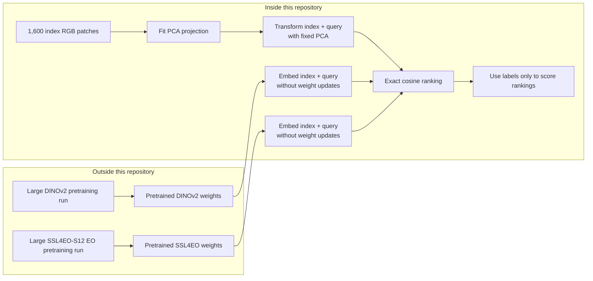
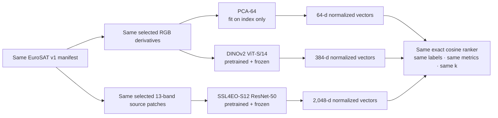
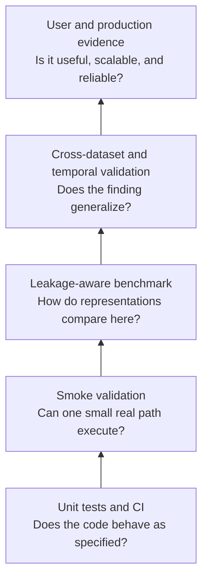

# Understanding training, retrieval, and the benchmarks

## The short answer

This project currently **uses pretrained neural networks but does not train or fine-tune them**.
DINOv2 and SSL4EO-S12 arrive with learned weights and remain frozen. The project uses them as
feature extractors: an image goes in and an embedding vector comes out.

PCA is different. It has no downloaded pretrained weights, so this project fits a 64-component
projection using only the 1,600 index images. That is a learned preprocessing step, but it is
unsupervised: PCA never sees the EuroSAT class labels, and it never sees the 400 query images while
fitting.

No model is currently trained to predict EuroSAT classes. The labels are opened only by the
evaluator after retrieval, like an answer key used to score the ranked results.

## Vocabulary

| Term | Meaning in this project |
|---|---|
| Model | A transformation that converts image pixels into a numeric representation |
| Checkpoint | A file containing neural-network weights learned during earlier pretraining |
| Fit | Estimate parameters from data; only PCA is fitted locally |
| Frozen | Loaded parameters are used but never updated |
| Inference | Pass images through a fixed model to calculate embeddings |
| Embedding | A fixed-length vector used to compare images |
| Index | The 1,600 searchable benchmark items; it is not a database product yet |
| Query | One of 400 held-out images used to request similar index items |
| Ranker | Exact cosine similarity, which orders index embeddings for each query |
| Relevance | Same EuroSAT class as the query, used as the current scoring proxy |
| Benchmark | A fixed dataset, protocol, metrics, and evidence record used for comparison |

## What learns where?

| Representation | Where its parameters were learned | What happens here | Uses EuroSAT labels to learn? | Sees query images while learning? |
|---|---|---|---:|---:|
| PCA-64 | In this project, from index RGB pixels | Fit once, then transform index and query | No | No |
| DINOv2 ViT-S/14 | Outside this project during DINOv2 pretraining | Load frozen checkpoint and infer RGB embeddings | No | No parameter learning |
| SSL4EO-S12 ResNet-50 | Outside this project during EO self-supervised pretraining | Load frozen checkpoint and infer 13-band embeddings | No | No parameter learning |

“Unsupervised” or “self-supervised” does not mean nothing was learned. It means the representation
was learned without this benchmark's ordinary class labels. DINOv2 and SSL4EO-S12 underwent large
pretraining runs conducted by their original authors. This repository consumes the resulting
checkpoints; it does not reproduce those pretraining runs.



## What is being benchmarked?

The benchmark asks a retrieval question, not a classification question:

> Given a held-out satellite patch, does the representation rank patches from the same broad
> EuroSAT class near the top of the index?

There is no classifier head choosing one of ten class names. Each model converts every patch into
a vector. For each query vector, exact cosine search compares it with all 1,600 index vectors and
returns the nearest ones. Only then does evaluation check the labels.

```mermaid
flowchart TD
    Source[Official EuroSAT archive<br/>27,000 georeferenced 13-band patches]
    Source --> Select[Deterministic class-balanced selection]
    Select --> Spatial[Spatial leakage controls<br/>disjoint 50 km cells + 5 km guard band]
    Spatial --> Index[1,600 index patches<br/>160 per class]
    Spatial --> Query[400 held-out queries<br/>40 per class]

    Index --> IndexEmbed[Create index embeddings]
    Query --> QueryEmbed[Create query embeddings]
    IndexEmbed --> Search[Exact cosine search]
    QueryEmbed --> Search
    Search --> TopK[Top 10 ranked index items per query]
    TopK --> Labels[Compare result labels with query label]
    Labels --> Metrics[P@10 · R@10 · mAP@10 · nDCG@10]
    Metrics --> Slices[Aggregate result + per-class slices + result grids]
```

## Why split into index and query?

The **index** is the searchable collection. The **query** set simulates new images presented to the
retrieval system. If nearly identical or nearby scenes appeared on both sides, the benchmark could
reward geographic memorization instead of a useful representation.

EuroSAT v1 therefore uses:

- 1,600 index patches and 400 query patches;
- 160 index and 40 query patches for each of ten classes;
- disjoint 50 km equal-area spatial cells;
- a minimum 5 km index/query centroid guard band;
- an observed minimum separation of 5.06623 km;
- one immutable manifest shared by all models.

The archive does not provide acquisition timestamps, so temporal or seasonal separation cannot be
verified. The spatial split is meaningful protection, but it is not a complete generalization
test.

## What changes and what stays fixed?

For a useful comparison, the selected patches, index/query membership, labels, query exclusions,
`k=10`, metrics, and exact ranker stay fixed. The representation path changes:



PCA and DINOv2 form the controlled RGB comparison because they consume the same RGB files.
SSL4EO-S12 consumes all 13 bands. Its result tests the complete EO-specific multispectral
representation, but it does not isolate why that representation wins. EO-specific pretraining,
architecture, vector dimension, preprocessing, and extra spectral bands all differ from DINOv2.

## How to read the four metrics

Every query has 160 relevant index items because there are 160 index patches with the same class.
At `k=10`, the system can return only ten items.

| Metric | Question it answers | Important detail here |
|---|---|---|
| Precision@10 | How many of the ten returned items have the query's class? | `0.853` means 8.53 of 10 results are relevant on average |
| Recall@10 | How many of all 160 relevant index items were returned? | Its maximum is only `10 / 160 = 0.0625` |
| AP@10 / mAP@10 | Are relevant items placed early, averaged across queries? | mAP combines top-rank cleanliness and ordering |
| nDCG@10 | How close is the ranking to an ideal ordering with relevant items first? | Earlier correct results receive more credit |

Recall therefore looks small even for a strong model. It should not be compared with precision as
if both had the same attainable range in this benchmark.

## Executed result

All numbers below come from the same 400 queries; no query was skipped.

| Representation | Input | Learning performed here | P@10 | R@10 | mAP@10 | nDCG@10 |
|---|---|---|---:|---:|---:|---:|
| PCA-64 | 64 × 64 RGB | Fit PCA on index only | 0.3015 | 0.01884 | 0.19698 | 0.31013 |
| DINOv2 ViT-S/14 | 224 × 224 RGB | None; frozen inference | 0.69475 | 0.04342 | 0.60763 | 0.70545 |
| SSL4EO-S12 ResNet-50 | 224 × 224, 13 bands | None; frozen inference | **0.8530** | **0.05331** | **0.81360** | **0.86472** |

The narrow supported conclusion is that frozen SSL4EO-S12 produced the strongest same-class
retrieval ranking on EuroSAT v1, followed by frozen DINOv2 and then PCA. It is not valid to conclude
that SSL4EO-S12 is universally best, or that non-visible bands alone caused its advantage.

## Tests, smoke runs, and benchmarks are different evidence



The project has code-health evidence, bounded STAC/chip smoke evidence, and one spatially separated
EuroSAT retrieval benchmark. It does not yet have temporal, cross-dataset, user-utility,
approximate-search, GPU-throughput, or production evidence.

## Would we train a model later?

Possibly, but training would be a new experimental phase rather than a hidden change to this
benchmark. Fine-tuning on EuroSAT would require a new data contract:

1. keep the current query set untouched as a final test set;
2. divide the non-query data into training and validation partitions with leakage controls;
3. train only on the training partition;
4. choose hyperparameters using validation, never the final queries;
5. report the frozen baseline and fine-tuned result separately;
6. repeat on another dataset before making a generalization claim.

For now, frozen models are valuable because they let us compare representations without adding a
supervised training loop, label leakage, hyperparameter tuning, or a much larger experiment matrix.

## Where to look next

- [EuroSAT benchmark guide](benchmark-eurosat.md): exact data preparation and commands.
- [Models and metrics](models-and-metrics.md): representation and metric details.
- [EuroSAT v1 results](results/eurosat-v1.md): aggregate results, per-class slices, and examples.
- [Validation record](validation.md): executed evidence and prohibited claims.
- [Architecture](architecture.md): system components and data boundaries.
