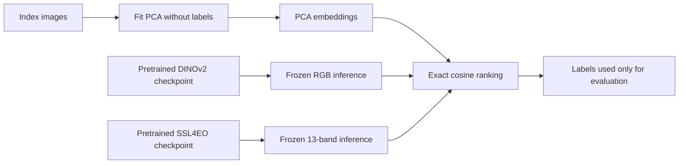
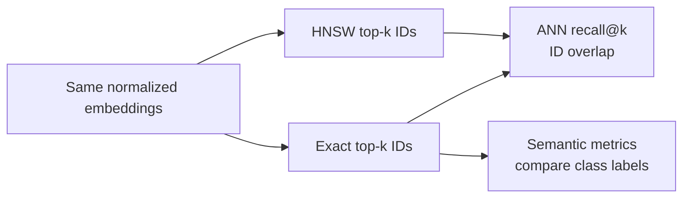

# Models and metrics

## What an embedding is

An image embedding is a fixed-length vector that represents an image. Retrieval compares a query
vector with index vectors and ranks the most similar ones.

The representation determines what “similar” means:

- flattened pixels emphasize direct color and spatial patterns;
- PCA keeps the dominant variation in those pixel patterns;
- DINOv2 features tend to capture more reusable visual structure and semantics;
- an EO-specific multispectral model may also capture information outside visible RGB.

This project starts with PCA and DINOv2 as a classical-versus-modern RGB comparison, then adds
SSL4EO-S12 as a frozen EO-specific 13-band experiment. No model is assumed to be best before
measurement.

## Training status at a glance



| Model | Pretrained? | Parameters learned in this repository? | EuroSAT labels used for learning? |
|---|---:|---:|---:|
| PCA-64 | No | Yes, index-fitted projection | No |
| DINOv2 | Yes | No, checkpoint is frozen | No |
| SSL4EO-S12 | Yes | No, checkpoint is frozen | No |
| TerraMind-Tiny challenger | Yes | No, checkpoint is frozen | No |

This distinction is explained step by step in
[Understanding training, retrieval, and the benchmarks](learning-benchmarks.md).

## PCA baseline

Principal Component Analysis learns orthogonal directions that explain the greatest variance in a
training matrix.

The current pipeline:

1. converts every image to RGB;
2. resizes it to 64 × 64 pixels by default;
3. scales channel values to 0–1;
4. flattens each image into 12,288 pixel features;
5. fits PCA on index images only;
6. transforms index and query images into the learned space;
7. L2-normalizes the output vectors.

Fitting on the index partition matters. If PCA saw query images while learning its components, the
evaluation representation would contain information from the held-out side of the experiment.

Strengths:

- transparent and inexpensive;
- deterministic with recorded inputs and seed;
- useful for detecting whether a complex model improves over color/pixel structure.

Limitations:

- resizing forces every image into a square and may distort geometry;
- high variance is not the same as semantic relevance;
- sensitive to illumination, color scaling, registration, and seasonal appearance;
- the basis is specific to the index partition it was fitted on, so a store and its saved
  projection belong together and must not be mixed across runs.

The fitted basis can be persisted with `embed-pca --projection-output` and reused to embed
images that were not in the original manifest. That is what makes PCA usable for a query the
corpus has never seen; see [Pipeline and CLI](pipeline-and-cli.md).

## DINOv2 baseline

DINOv2 is a self-supervised Vision Transformer trained to produce general visual features without
requiring ordinary class labels for every pretraining image.

The current pipeline:

1. converts each image to RGB;
2. resizes it to 224 × 224 pixels with bicubic interpolation;
3. applies standard ImageNet channel normalization;
4. runs an official PyTorch Hub DINOv2 model in evaluation/inference mode;
5. uses the model output as the image representation;
6. L2-normalizes the vectors.

The default and verified model is `dinov2_vits14`, which produces 384-dimensional features. The
code also permits ViT-B/14 and register-token variants, but they require separate validation.

The model is frozen: this repository does not train or fine-tune DINOv2.

Strengths:

- reusable visual features learned from a large and diverse image corpus;
- usually more semantic than direct pixel comparisons;
- no task-specific training required for the baseline.

Limitations:

- accepts RGB, while EO products often contain informative non-visible bands;
- was not designed specifically around Sentinel-2 radiometry or geospatial metadata;
- square resizing can discard scale and aspect-ratio information;
- preview rendering may dominate the feature instead of underlying surface properties.

For these reasons, DINOv2 is an RGB baseline, not an EO-specific multispectral model.

## SSL4EO-S12 multispectral experiment

SSL4EO-S12 is a self-supervised EO representation pretrained on geographically diverse,
multi-season Sentinel-1 and Sentinel-2 imagery. The selected MoCo ResNet-50 checkpoint consumes
all 13 Sentinel-2 Level-1C bands and returns a 2,048-dimensional feature vector.

The current pipeline:

1. verifies the official EuroSAT archive and pinned checkpoint checksums;
2. reads only each manifest-selected 13-band TIFF member from the archive;
3. moves EuroSAT's last-position `B8A` band between `B08` and `B09` as expected by the model;
4. clips digital numbers to 0–10,000 and divides by 10,000;
5. resizes to 256 × 256 and takes a centered 224 × 224 crop;
6. runs the frozen ResNet-50 encoder and L2-normalizes its output.

This experiment uses no EuroSAT labels during embedding. It changes both the pretraining domain
and available input bands relative to DINOv2, so a score difference measures the representation
pipeline as a whole; it does not by itself prove that non-visible bands caused the difference.
See [ADR 0003](decisions/0003-ssl4eo-s12-multispectral-encoder.md) for model selection and risks.

## TerraMind-Tiny challenger

The optional TerraTorch backend loads a pinned TerraMind-Tiny checkpoint, consumes the same
13-band L1C archive members, and produces a 192-dimensional vector by averaging the final
normalized patch features and applying L2 normalization. It uses fixed published pretraining
statistics in raw digital-number units, not SSL4EO's clipping and 0-1 scaling. All required
backbone weights must match; the adapter rejects missing weights rather than retaining random
initialization. See the [fixed TerraMind protocol](benchmark-terramind.md).

This is an experimental frozen representation, not a newly trained model or an assumed winner.
EuroSAT v1 is now explicitly a regression/development benchmark; fresh held-out data is required
for confirmatory selection. The executed mAP@10 was 0.68688, below SSL4EO's 0.81360 and above
DINOv2's 0.60763. See [TerraMind results](results/terramind-v1.md) for the complete evidence.

## Fair model comparison

A representation benchmark is meaningful only when every model uses:

- the same selected source patches, while model-appropriate inputs are recorded explicitly;
- the same index/query split;
- the same relevance labels;
- the same query exclusions;
- the same `k` values;
- recorded preprocessing and model configuration.

Changing both the selected dataset and model at once prevents a useful interpretation. Using RGB
for PCA/DINOv2 and 13 bands for SSL4EO-S12 is intentional, but means the multispectral comparison
is not a controlled band ablation.

## Exact cosine retrieval

Cosine similarity measures the angle between two vectors:

```text
cosine(q, x) = dot(q, x) / (norm(q) * norm(x))
```

All embeddings are L2-normalized, so search reduces to a matrix-vector dot product. Larger scores
indicate closer directions in embedding space.

Exact search scores every index vector. It is simple and gives the reference ranking against which
approximate search is measured.

## Faiss exact and HNSW search

Faiss `IndexFlatIP` scores every normalized vector and is the exact systems reference.
`IndexHNSWFlat` builds a navigable graph and visits only a candidate subset during a query. Adding
vectors to that graph is index construction, not model training: no image encoder weights change.

Approximate-search recall has a different denominator from semantic Recall@k:

```text
ANN recall@k = exact top-k neighbor IDs also returned by HNSW / k
```

ANN recall answers whether HNSW reproduced the exact ranker. Semantic Recall@k, described below,
answers how many label-relevant items were found. Never report one as the other.



See [the Faiss benchmark](benchmark-faiss.md) and
[executed v1 results](results/faiss-v1.md) for configuration, latency, construction, storage, and
memory measurements.

## Relevance definition

The evaluator currently uses binary class-label relevance:

```text
result label equals query label  -> relevant
result label differs             -> not relevant
```

This is a benchmark proxy. Two images with the same broad scene class may not satisfy the same user
intent, and two different classes may still be visually or operationally related.

## Precision@k

Precision asks how clean the first `k` results are:

```text
Precision@k = relevant results in top k / k
```

If three of the top five images are relevant, Precision@5 is 0.60.

Use it when users care mainly about the quality of the visible result page.

## Recall@k

Recall asks how much of the available relevant set was found:

```text
Recall@k = relevant results in top k / all relevant index images
```

If four relevant images exist and three appear in the top five, Recall@5 is 0.75.

Use it when missing relevant material is costly. Recall naturally depends on how many relevant
items exist for each query.

## Average Precision@k and mAP@k

Average Precision rewards relevant results at early ranks. At each relevant hit, it records the
precision up to that rank, sums those values, and normalizes by the number of relevant results that
could be retrieved within `k`.

Mean Average Precision, or mAP, averages AP across evaluated queries. It combines ranking order and
retrieval coverage into one summary, but per-query and per-class inspection is still necessary.

## nDCG@k

Discounted Cumulative Gain assigns more value to relevance near the top of the ranking. The gain at
later ranks is reduced logarithmically. Normalized DCG divides the observed score by the best
possible ordering, producing a value between 0 and 1 for the current binary-relevance setup.

nDCG becomes especially useful if the project later collects graded judgments such as “highly
relevant,” “partly relevant,” and “not relevant.”

## Aggregation and skipped queries

The evaluator calculates each metric per eligible query and reports the arithmetic mean. A query
is skipped when:

- it has no label; or
- no index item has the same label.

Always report `evaluated_queries` and `skipped_queries` with the metric values. A high score over a
small or selectively eligible query set can be misleading.

The evaluator also reports each metric grouped by query class. These slices reveal whether the
macro result reflects consistent behavior or is dominated by visually distinctive classes.

## What the current metrics do not prove

The metrics do not prove:

- geographic generalization;
- robustness across seasons, sensors, clouds, or resolutions;
- usefulness for a specific analyst task;
- calibrated semantic similarity;
- online latency or scalability;
- universal superiority of one representation outside EuroSAT v1.

Those claims require an appropriate dataset, leakage controls, error analysis, and executed
validation. See [Validation](validation.md) for the current evidence boundary.
