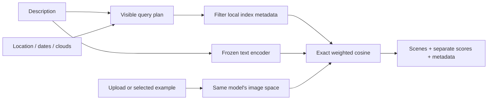

# Text, image and hybrid search

The local scene-search interface accepts a description, an uploaded RGB image, a selected corpus
example, or a description and example together. It uses a frozen RemoteCLIP ViT-B/32 model to
place images and text in the same 512-dimensional space. Existing PCA, DINOv2 and multispectral
stores remain usable through `query` and the representation-comparison viewer.

The [research decision](decisions/0012-multimodal-search.md) explains model alternatives, search
policy, and the evaluation still needed. RemoteCLIP is an experimental RGB semantic baseline;
it is not a multispectral model or a verified change detector.

## How a request works



The hybrid score is `alpha × text cosine + (1-alpha) × image cosine`, initially 50/50. Text-only
uses 100% text; image-only uses 100% image. Both inputs remain visible in hybrid output even at
weight endpoints. Scores are not probabilities. A stored example is excluded from its results;
query-partition rows never become search candidates. An upload does not have a known corpus ID,
so duplicates of the uploaded content may be returned.

## Install in a separate environment

Use the project's [locked-environment setup](evaluation-foundations.md) to install `uv` first.
Keep the existing benchmark environments intact. From the repository root:

```powershell
$uv = 'C:\Users\<you>\.venvs\eovr-tools\Scripts\uv.exe'
$env:UV_PROJECT_ENVIRONMENT = 'C:\Users\<you>\.venvs\eovr-mm'
& $uv sync --locked --python 3.11 --extra app --extra multimodal --extra cpu
$python = 'C:\Users\<you>\.venvs\eovr-mm\Scripts\python.exe'
```

CPU is the default. Use the mutually exclusive `cuda` extra instead of `cpu` and `--device cuda`
only with a compatible GPU. The weights download is approximately 605 MB; the environment and
runtime need additional disk and memory. No paid service, API key, or account is required.

## Build the semantic index

For the prepared EuroSAT corpus:

```powershell
& $python -m eo_visual_retrieval.cli embed-remoteclip `
  --manifest data/eurosat-v1/manifest.jsonl --image-root data/eurosat-v1/images `
  --output artifacts/eurosat-v1-remoteclip-vit-b32.npz --batch-size 16
```

Or use the locally prepared temporal corpus, which carries acquisition dates and cloud metadata:

```powershell
& $python -m eo_visual_retrieval.cli embed-remoteclip `
  --manifest data/temporal-v1/manifest-guarded.jsonl --image-root data/temporal-v1/images `
  --output artifacts/temporal-v1g-remoteclip-vit-b32.npz --batch-size 16
```

The guarded temporal manifest comes from `temporal-resplit`; see the
[guarded temporal results](results/temporal-v1-guarded.md). These paths are local artifacts, not files included
in a clone. Do not substitute a different manifest for an existing embedding store.

The embedding command verifies declared source image hashes, downloads the pinned model on its
first run, checks the weight digest, and records the representation and corpus identity in the
NPZ. It fits no parameters. The new vectors remain under ignored `artifacts/`.

## Open the interface

```powershell
& $python -m eo_visual_retrieval.cli serve-search `
  --manifest data/temporal-v1/manifest-guarded.jsonl --image-root data/temporal-v1/images `
  --embeddings artifacts/temporal-v1g-remoteclip-vit-b32.npz --port 8002
```

Open `http://127.0.0.1:8002`. The page reports index size, date range, and cloud-metadata coverage.
Enter a description for text search; select or upload an example for image search; provide both
for hybrid search. A result's **Use as example** button keeps the description so it can refine
the next search. **Review filters** shows the interpretation without running model inference.

The service validates image hashes and model/manifest compatibility at startup. It holds one
encoder per process, serializes model inference, and uses local cached weights. `--checkpoint`
can point to a local copy, but it must match the pinned digest. The `serve` command and existing
Docker/Compose definition still launch the lighter comparison viewer; they do not include this
model service or its weights.

## The Athens example

For “Sentinel imagery showing recent urban expansion near Athens with low cloud coverage”, the
documented convenience defaults are:

| Phrase | Visible interpretation |
|---|---|
| Sentinel imagery | Collection `sentinel-2-l2a` |
| Near Athens | Approximate Athens, Greece box `[23.4, 37.7, 24.1, 38.2]`, matching chip centers |
| Recent | Last 90 days through today's UTC date |
| Low cloud coverage | Scene-level cloud percentage at most 10 |
| Urban expansion | Semantic similarity only, accompanied by the temporal-evidence limitation |

The complete description is passed to the text encoder; recognized constraints are also applied
as hard filters. Explicit controls override defaults. Disable **Interpret supported prompt
defaults** to remove inferred constraints entirely. Negation disables the defaults, since a
keyword matcher cannot safely interpret “not near Athens”. Other cities, date phrases, numeric
cloud phrases, or logical expressions require explicit controls; the helper is deliberately
not advertised as general natural-language understanding.

The current temporal corpus is from 2024. A genuinely recent request should therefore return
**no matches**, even if it contains scenes near Athens. EuroSAT has neither dates nor cloud
percentages, so those constraints also exclude its scenes. The interface does not weaken filters
to fill a result grid. For exploration of the historical temporal corpus, use explicit 2024
dates or disable defaults. Scene cloud metadata does not establish that a chip is cloud-free.

Searching a newer area or period requires the separate bounded STAC discovery/chip workflow and
rebuilding a store. Searching does not initiate acquisition. Urban-expansion evidence additionally
requires aligned observations from multiple dates and an appropriate change-assessment method.

## CLI and API

All modes use the same `search` command. Replace the example ID with one in the supplied manifest:

```powershell
$corpus = @('--manifest', 'data/temporal-v1/manifest-guarded.jsonl',
  '--image-root', 'data/temporal-v1/images',
  '--embeddings', 'artifacts/temporal-v1g-remoteclip-vit-b32.npz')
& $python -m eo_visual_retrieval.cli search @corpus --text 'Buildings beside agricultural fields'
& $python -m eo_visual_retrieval.cli search @corpus --image data/incoming/example.png
& $python -m eo_visual_retrieval.cli search @corpus --text 'Industrial buildings' `
  --item-id '<corpus-item-id>' --text-weight 0.65
& $python -m eo_visual_retrieval.cli search @corpus --text 'Urban scenes near Athens' `
  --start-date 2024-01-01 --end-date 2024-12-31 --max-cloud-cover 10 --k 5
```

`--plan-only` prints the plan without reading any model or corpus files; the corpus arguments
remain required by the command grammar. `--no-prompt-defaults` uses only explicit filters.

HTTP exposes `GET /api/corpus`, `POST /api/plan` (JSON), `POST /api/search` (multipart containing
a JSON `query` field and an optional `image` file), `GET /thumbnail?item_id=...`, and `/healthz`.
FastAPI's `/docs` documents the plan schema. Search JSON includes `mode`, `plan`, `text_weight`,
eligible-candidate count, combined/text/image scores, and allowlisted scene metadata. Unknown
fields, invalid dates/bounds, nonfinite weights, and conflicting image inputs are rejected.

Uploads are limited to 8 MiB for the complete request and 16,777,216 decoded pixels. The encoder's
own aspect-preserving resize and crop are used for both corpus images and uploads. Multipart
parsing may spool to temporary disk; the application does not retain uploads or log their bodies.
Prompts exceeding 75 CLIP content tokens are rejected rather than silently truncated.

## Validation boundary

Run code-health gates with the `dev` and other CI extras installed. Browser tests also need the
`browser` extra and a Playwright Chromium installation. Keep unit and browser invocations separate:
in an environment with Playwright installed, use `python -m pytest --ignore=tests/browser` followed
by `python -m pytest tests/browser`. Its session event loop can conflict with the existing
low-level asyncio tests if both groups run together. Existing result reproduction is:

```powershell
& $python scripts/verify_retrieval_results.py
```

The script recomputes stored label-retrieval metrics and fails on a difference without rewriting
the published reports. It does not rerun hardware timing experiments. Unit and browser fixtures
test ranking and UI behavior; they cannot establish semantic quality. See
[validation](validation.md) for executed real-model checks and the remaining relevance gate.
