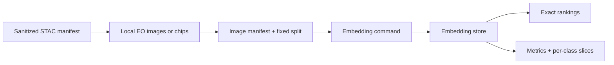
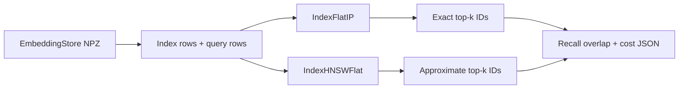

# Pipeline and CLI

## Mental model

The command-line workflow moves through a sequence of durable, inspectable artifacts:



Each command performs one bounded transformation. This makes failures easier to diagnose and lets
all representations reuse the same selected patches and split.

## Install the command

From the repository root:

```powershell
C:\Users\<you>\.venvs\eovr\Scripts\python -m pip install -e ".[dev,stac,ml]"
eovr --help
```

Optional dependency groups are separated by responsibility:

- `dev`: Ruff, Pytest, and coverage;
- `stac`: PySTAC Client, Requests, and Planetary Computer support;
- `geo`: Rasterio for geospatial windows, alignment, masks, and GeoTIFF output;
- `ml`: scikit-learn, PyTorch, and torchvision.

## Path A: discover public EO imagery

### 1. Search a STAC catalog

```powershell
eovr stac-search `
  --api-url https://planetarycomputer.microsoft.com/api/stac/v1 `
  --collection sentinel-2-l2a `
  --bbox -122.2751 47.5469 -121.9613 47.7458 `
  --datetime 2024-06-01/2024-06-30 `
  --max-cloud-cover 20 `
  --limit 20 `
  --output data/manifests/stac-items.jsonl
```

Inputs:

- `--bbox W S E N`: longitude/latitude search rectangle;
- `--datetime`: one timestamp or an interval;
- `--max-cloud-cover`: optional scene-level metadata filter;
- `--limit`: maximum returned items, constrained to 1–1000.

Output: one sanitized `StacItemRecord` per line. The file contains item identity and safe metadata,
but no asset URLs.

Cloud cover is a scene-level hint. It does not guarantee that a future chip is cloud-free.

### 2. Materialize bounded previews

```powershell
eovr stac-materialize `
  --manifest data/manifests/stac-items.jsonl `
  --output-dir data/stac-previews `
  --image-manifest data/manifests/stac-images.jsonl `
  --asset rendered_preview `
  --signer planetary-computer `
  --limit 20
```

The command resolves each item at runtime, optionally signs it in memory, validates HTTPS and
image media type, streams the response with retries, enforces a per-file byte limit, and replaces
the destination atomically.

Output records are unlabeled `stac-preview` images assigned to the index. They support embedding
smoke tests and visual exploration, not quantitative evaluation.

### 3. Materialize an aligned Sentinel-2 chip

Choose one item ID from the sanitized STAC manifest and request a small WGS84 bounding box:

```powershell
eovr stac-chip `
  --manifest data/manifests/stac-items.jsonl `
  --item-id <stable-stac-item-id> `
  --bbox -122.15 47.60 -122.13 47.62 `
  --output-dir data/stac-chips `
  --image-manifest data/manifests/stac-chip.jsonl `
  --signer planetary-computer `
  --reflectance-min 0.0 `
  --reflectance-max 0.3 `
  --max-pixels 1048576
```

The command:

1. resolves the stable item and signs assets only in memory;
2. opens `B04`, `B03`, `B02`, and `SCL` Cloud-Optimized GeoTIFFs;
3. converts the WGS84 bounds to the red band's projected CRS;
4. snaps the request to the 10 m red-band pixel grid;
5. aligns the other RGB bands bilinearly and SCL with nearest-neighbour resampling;
6. applies processing-baseline-aware BOA reflectance scale and offset;
7. masks nodata, defective, cloud, shadow, cirrus, and snow/ice pixels;
8. writes float32 reflectance and fixed-stretch uint8 RGB GeoTIFFs atomically;
9. writes one sanitized image-manifest record pointing to the RGB artifact.

The default SCL policy masks classes `0, 1, 3, 7, 8, 9, 10, 11`. Use `--no-mask-scl` only for a
deliberate comparison and record that choice. The pixel limit bounds output dimensions, while COG
range reads avoid downloading complete Sentinel-2 tiles.

The reflectance artifact is the auditable physical representation. The RGB artifact is the
deterministically normalized model input used by PCA and DINOv2.

## Path B: build a labeled retrieval dataset

### 1. Organize images

```text
data/images/
  class-a/
    image-001.png
    image-002.png
  class-b/
    image-003.png
```

The first directory component is treated as the label. Files directly under the root are
unlabeled and will be skipped by evaluation.

Supported extensions are JPEG, PNG, WebP, TIFF, and GeoTIFF-style TIFF names.

### 2. Build the manifest

```powershell
eovr manifest-build `
  --images data/images `
  --output data/manifests/images.jsonl `
  --query-fraction 0.2 `
  --seed 42
```

The builder hashes file contents, groups unique hashes by label, ranks them deterministically from
the seed, and assigns query/index membership. Where a label has at least two unique images, it
keeps at least one item on each side.

The hash protects against exact duplicates crossing the split. It does not identify nearby crops,
overlapping scenes, or repeated observations of the same location.

## Path C: prepare the georeferenced EuroSAT benchmark

The generic folder manifest protects only against byte-identical duplicates. The benchmark
builder uses EuroSAT's source georeferencing to enforce the stronger published split:

```powershell
eovr benchmark-eurosat-prepare `
  --archive data/downloads/EuroSAT_MS.zip `
  --output-dir data/eurosat-v1/images `
  --manifest data/eurosat-v1/manifest.jsonl `
  --queries-per-class 40 `
  --index-per-class 160 `
  --group-size-km 50 `
  --minimum-separation-km 5 `
  --seed 42
```

The manifest and selected patches are shared by all three embedding commands. Preparation verifies
the official archive checksum, preserves source georeferencing in RGB derivatives, and records
spatial split metadata. See [EuroSAT benchmark](benchmark-eurosat.md) for the complete contract.

Re-run the split and file integrity checks without touching the dataset:

```powershell
eovr benchmark-eurosat-audit `
  --manifest data/eurosat-v1/manifest.jsonl `
  --image-root data/eurosat-v1/images
```

## Generate embeddings

### PCA

```powershell
eovr embed-pca `
  --manifest data/manifests/images.jsonl `
  --image-root data/images `
  --components 64 `
  --image-size 64 `
  --seed 42 `
  --output artifacts/pca-64.npz `
  --projection-output artifacts/pca-64-projection.npz
```

PCA is fitted only on index items and then transforms every item. The requested component count
cannot exceed the number of index samples or flattened input dimensions.

`--projection-output` is optional but recommended. PCA is the one representation this project
fits itself, so its basis cannot be recovered from a public checkpoint. Saving it is what allows
an image outside this manifest to be embedded later; without it, the store can only be queried by
an ID it already contains. The saved file holds the mean, the components, the image size, and the
seed, and records the same run metadata as the store.

### DINOv2

```powershell
eovr embed-dinov2 `
  --manifest data/manifests/images.jsonl `
  --image-root data/images `
  --model dinov2_vits14 `
  --batch-size 8 `
  --device auto `
  --output artifacts/dinov2-vits14.npz
```

`--device auto` selects CUDA only when the installed PyTorch build reports it as available. The
first run may download model code and weights through the official PyTorch Hub entrypoint.

### SSL4EO-S12

For the fixed EuroSAT benchmark, download the pinned TorchGeo checkpoint into the ignored local
model directory as described in the [benchmark guide](benchmark-eurosat.md), then run:

```powershell
eovr embed-ssl4eo `
  --manifest data/eurosat-v1/manifest.jsonl `
  --archive data/downloads/EuroSAT_MS.zip `
  --checkpoint data/models/resnet50_sentinel2_all_moco-df8b932e.pth `
  --batch-size 16 `
  --device auto `
  --output artifacts/eurosat-v1-ssl4eo-s12-moco-resnet50.npz
```

This command verifies both inputs, reads selected 13-band members directly from the source ZIP,
applies the pinned band order and preprocessing, and writes frozen 2,048-dimensional features. It
works only with `eurosat-ms-v1` records carrying an `archive_member`; it is deliberately narrower
than the generic RGB backends.

All embedding commands preserve manifest order and write IDs, vectors, labels, splits, backend and
preprocessing configuration, manifest SHA-256, item counts, Python version, and relevant package
versions to a compressed NPZ store.

## Query the index

Both forms build an index from records whose split is `index` and print the backend, the query
identity, and ranked item IDs with cosine scores as JSON.

### By stored item

```powershell
eovr query `
  --embeddings artifacts/dinov2-vits14.npz `
  --item-id forest/example.jpg `
  --k 5
```

The query ID must already exist in the store, and is excluded from its own results.

### By a new local image

```powershell
eovr query `
  --embeddings artifacts/pca-64.npz `
  --image data/incoming/unseen-chip.png `
  --projection artifacts/pca-64-projection.npz `
  --k 5
```

The image is embedded with the backend recorded in the store's own metadata, so a ranking is
never produced by preprocessing that disagrees with the vectors it is compared against.

| Store backend | New-image query | Requirement |
|---|---|---|
| `pca` | Supported | `--projection` from `embed-pca --projection-output` |
| `dinov2` | Supported | The model name recorded in the store; weights are fetched on first use |
| `ssl4eo-s12` | Refused | Reads 13-band members from the verified archive, not an RGB file |
| `terramind` | Refused | Same 13-band archive contract |

The multispectral backends refuse rather than approximate: an RGB rendering is not the input
those encoders were pretrained on, and silently substituting one would invalidate the ranking.
Query them with `--item-id` against the prepared benchmark instead.

## Evaluate rankings

```powershell
eovr evaluate `
  --embeddings artifacts/dinov2-vits14.npz `
  --k 10 `
  --output artifacts/dinov2-vits14-k10.json
```

Evaluation requires at least one index item and one query item. `k` cannot exceed the index size.
A result is relevant when its label equals the query label. Unlabeled queries and labels with no
matching index item are skipped and reported separately.

The JSON output contains the macro average over eligible queries and a `per_class` section with
the same metrics and evaluated-query count for each label.

See [Models and metrics](models-and-metrics.md) before interpreting the output.

## Evaluate multi-label development queries

For multi-label data, use the separate development evaluator:

```powershell
eovr evaluate-multilabel `
  --embeddings artifacts/bigearthnet-development.npz `
  --relevance data/bigearthnet-v2/relevance.json `
  --k 10 --threshold 0.5 `
  --output outputs/bigearthnet-development-k10.json
```

This requires a store with `None` single-label entries and a relevance manifest bound to the
same image-manifest SHA-256. It reports binary Jaccard metrics and raw-Jaccard nDCG, scores only
development queries, and records input hashes. No final-scoring option exists. The example inputs
must first be prepared; see [BigEarthNet acquisition and evaluation](benchmark-bigearthnet.md).

## Inspect single-label qualitative results

```powershell
eovr result-grid `
  --embeddings artifacts/dinov2-vits14.npz `
  --manifest data/manifests/images.jsonl `
  --image-root data/images `
  --output artifacts/dinov2-worst.png `
  --k 5 `
  --mode worst
```

The command selects one best or worst AP@k query per class and renders the query beside its exact
top-k results. Relevance borders make class-level successes and confusions visible. Run both modes
for each backend; individual examples complement metrics but do not replace them.

## Benchmark approximate search

Install the optional search group, then compare Faiss exact search with HNSW on an existing
embedding store:

```powershell
python -m pip install -e ".[search]"

eovr benchmark-faiss `
  --embeddings artifacts/eurosat-v1-dinov2-vits14.npz `
  --output docs/results/faiss-v1-dinov2-1600.json `
  --corpus-size 1600 `
  --k 10 `
  --m 32 `
  --ef-construction 200 `
  --ef-search 16 32 64 128 `
  --threads 1 `
  --warmups 2 `
  --repeats 7
```

The command takes already-created vectors; it does not train an encoder. It normalizes index and
query rows, uses Faiss `IndexFlatIP` for exact top-k IDs, constructs one `IndexHNSWFlat`, and
queries that graph at each `efSearch` value.



If `--corpus-size` exceeds the real index count, deterministic perturbed copies are added and the
result is marked synthetic. Such a run measures search mechanics only. See
[Exact versus approximate search benchmark](benchmark-faiss.md) before interpreting its output.

## Optional foundation-model and tracking actions

`eovr embed-terramind` runs the pinned frozen TerraMind-Tiny S2L1C experiment. It requires local
verified data/checkpoint files and the `foundation`, `ml`, and `geo` groups. See
[TerraMind protocol](benchmark-terramind.md) for exact inputs, transforms, and commands.

`eovr evaluate --tracking-dir outputs/tracking` adds local MLflow logging to the unchanged exact
evaluation path. Without this option, MLflow is not imported or required. Tracking stores only
aggregate metrics and allowlisted content identities; full per-class reports remain in the
requested local JSON. See [Evaluation foundations](evaluation-foundations.md).

## Serve the comparison surface

```powershell
eovr serve `
  --manifest data/eurosat-v1/manifest.jsonl `
  --image-root data/eurosat-v1/images `
  --store artifacts/eurosat-v1-pca-64.npz `
  --store artifacts/eurosat-v1-dinov2-vits14.npz `
  --store artifacts/eurosat-v1-ssl4eo-s12-rgb-moco-resnet50.npz `
  --store artifacts/eurosat-v1-ssl4eo-s12-moco-resnet50.npz `
  --projection artifacts/eurosat-v1-pca-64-projection.npz
```

`--store` is repeatable, and representations appear in the order given. Placing the SSL4EO 13-band
store beside its RGB variant shows the band ablation as rankings rather than as a table.

The server loads only precomputed vectors, so it imports no model framework. Ranking is a
matrix-vector product; an uploaded image is embedded with the persisted PCA basis, the one
representation this project fits itself. Without `--projection` the upload path is disabled and the
page says so.

The catalog refuses to start when the supplied stores disagree on their manifest hash or item
ordering, because a comparison across different corpora would be meaningless while looking correct.

Uploads carry no label, so their results are shown without relevance colouring and without a
per-query metric. Grey means unknown, not wrong.

## Reproducibility checklist

For a benchmark run, record:

- dataset and version;
- image/chip-generation configuration;
- manifest hash or immutable copy;
- split seed and grouping policy;
- index/query counts and class balance;
- embedding backend, model, dimensions, and preprocessing;
- `k` values;
- package versions, Python version, and device;
- search index type, metric, threads, construction/search parameters, and corpus-size provenance;
- exclusions, skipped queries, and known leakage risks.

Generated data and embeddings stay outside Git. Commit sanitized configuration, aggregate metrics,
and enough provenance for another person to reproduce the run.

## Common failure conditions

| Symptom | Meaning |
|---|---|
| `manifest references missing image` | Image root and manifest path do not match |
| `identical image content has conflicting labels` | A duplicate file appears under different classes |
| `components must be between...` | PCA dimension exceeds available index samples/input dimensions |
| `no labeled queries have relevant index items` | The split cannot support label-proxy evaluation |
| `query dimension does not match the index` | Vectors from incompatible stores/models were mixed |
| `asset exceeds ... byte limit` | The materializer stopped an unexpectedly large download |
| `chip contains ... pixels` | The requested spatial window exceeds the configured safety bound |
| `s2:processing_baseline` missing | The reflectance offset cannot be determined safely |
| CUDA requested but unavailable | The installed PyTorch build or machine does not expose CUDA |
| `Faiss benchmark dependencies are missing` | Install the optional `search` dependency group |
| `every ef_search value must be at least k` | HNSW search breadth is too small for the requested result count |
