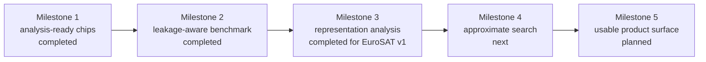

# Project context and roadmap

## Goal

Build a public, educational Earth-observation visual-retrieval project that demonstrates sound
retrieval engineering from data discovery through evaluation. The project should make each step
understandable, reproducible, and safe to publish.

The intended learning outcomes are:

- understand STAC catalogs and safe EO data access;
- create deterministic datasets and leakage-aware evaluation splits;
- compare classical and modern image representations fairly;
- implement exact ranking before approximate vector search;
- interpret retrieval metrics without overstating what they prove;
- evolve an evaluated offline pipeline into a small usable application.

## Current state

The repository currently contains:

- a typed Python package and `eovr` command-line interface;
- provider-neutral STAC discovery with sanitized JSONL manifests;
- bounded public preview materialization with optional in-memory signing;
- aligned Sentinel-2 BOA-reflectance and model-ready RGB chip materialization;
- deterministic image manifests with index/query partitions;
- PCA, frozen RGB DINOv2, and frozen 13-band SSL4EO-S12 embedding backends;
- portable compressed embedding stores;
- exact cosine retrieval and four ranked-retrieval metrics;
- an executed 2,000-image, spatially separated EuroSAT benchmark;
- aggregate and per-class metrics plus qualitative best/worst grids for all three representations;
- unit tests, linting, CI, and executed smoke validation.

The current evidence proves that the workflow runs and establishes a first bounded RGB and
multispectral representation comparison on spatially separated EuroSAT v1. It does **not**
establish temporal, cross-dataset, or production generalization, nor isolate the causal value of
extra bands. No portfolio claim should exceed the evidence in `docs/validation.md`.

## Project boundaries

- The project is generic and public; it contains no employer or role-specific context.
- STAC manifests contain stable identity and allowlisted metadata, never signed asset URLs.
- Preview images are learning inputs, not analysis-ready benchmark data.
- DINOv2 is an RGB baseline, not a multispectral EO model.
- PCA and any other learned preprocessing must be fitted on the index/training partition only.
- Benchmark splits must prevent spatial and temporal leakage.
- Exact cosine search remains the quality reference when approximate search is introduced.
- Raw imagery, generated vectors, credentials, and private areas of interest remain outside Git.

## Prioritized roadmap

### Milestone 1: analysis-ready Sentinel-2 RGB chip — completed

The first narrow materialization path for Sentinel-2 `B04`, `B03`, and `B02` now:

- reads only a requested spatial window;
- aligns the bands on a documented pixel grid;
- records CRS, affine transform, ground sampling distance, and source item identity;
- applies documented reflectance scaling and deterministic RGB normalization;
- handles nodata and cloud/SCL information explicitly;
- writes a sanitized image manifest without source URLs;
- includes local raster fixtures and tests for pixel, metadata, and failure behavior.

It produces separate reflectance and model-ready RGB GeoTIFFs, aligns the 20 m SCL layer to the
10 m reference grid, and records processing-baseline-aware scaling. Local raster tests and one
bounded public smoke run validate the vertical slice. Bulk downloading remains out of scope until
benchmark dataset design determines the required sampling strategy.

### Milestone 2: labeled EO retrieval benchmark — completed

The first benchmark design is now implemented around the official georeferenced EuroSAT
multispectral archive. It creates a 2,000-image, class-balanced RGB subset with disjoint 50 km
spatial cells and a 5 km index/query guard band. See `docs/benchmark-eurosat.md` and ADR 0002.

The executed benchmark contains 1,600 index images and 400 queries. All files and spatial policies
were audited, and PCA, DINOv2, and SSL4EO-S12 were evaluated on the same manifest. See
`docs/results/eurosat-v1.md` for evidence and interpretation. A STAC-derived benchmark becomes
appropriate once geographic groups and temporal holdouts are available.

Record:

- dataset name, version, and provenance;
- label semantics and known limitations;
- split algorithm, seed, and exclusions;
- class balance and query/index counts;
- geographic and temporal grouping rules;
- model and preprocessing configuration.

**Benchmark gate:** report PCA, DINOv2, and SSL4EO-S12 Precision@k, Recall@k, mAP@k, and nDCG@k on
the same leakage-aware split, accompanied by qualitative success and failure examples. — completed
for EuroSAT v1

### Milestone 3: retrieval analysis

- Compare PCA and DINOv2 fairly on identical inputs and splits. — completed for EuroSAT v1
- Add query-result grids and per-class error slices. — completed for EuroSAT v1
- Add geographic, seasonal, and cloud-condition slices when metadata supports them.
- Explain what class-label relevance captures and what it misses about user intent.
- Evaluate one EO-specific or multispectral encoder as a separate experiment. — completed with
  SSL4EO-S12 on EuroSAT v1

### Milestone 4: approximate search

Add Faiss while retaining exact cosine search as the reference. Measure:

- recall relative to exact search;
- query latency;
- index build time;
- serialized index size;
- runtime memory at multiple corpus sizes.

### Milestone 5: usable project surface

Expose the evaluated workflow through a small API or interactive demo. A user should be able to
select or upload a public query chip, inspect ranked results and metadata, and see which model and
index generated the ranking.

Containers and release automation should be added when they support this workflow, not as isolated
portfolio decoration.

## Portfolio-ready definition

The project is portfolio-ready when:

- a clean clone can reproduce the documented benchmark;
- tests and CI pass on supported Python versions;
- data provenance, relevance assumptions, and leakage controls are explicit;
- performance claims link to recorded evidence and configuration;
- PCA and DINOv2 are directly comparable on RGB, while SSL4EO-S12 preserves the selected patches,
  split, relevance, and ranker with its explicitly different 13-band input;
- representative successes and failures are visible;
- no private data, sensitive geography, signed URLs, or generated datasets are committed;
- the repository name and release metadata match the EO visual-retrieval identity.

## Next task

Begin Milestone 4 with a reproducible Faiss experiment that treats exact cosine results as ground
truth. Define corpus-size tiers and record approximate recall, latency, build time, serialized
index size, and runtime memory without replacing the exact quality reference.
