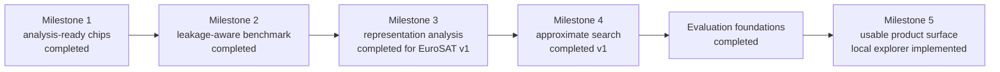

# Project context and roadmap

## Goal

Build a public, educational Earth-observation visual-retrieval project that demonstrates sound
retrieval engineering from data discovery through evaluation. The project should make each step
understandable, reproducible, and safe to publish.

The intended learning outcomes are:

- understand STAC catalogs and safe EO data access;
- create deterministic datasets and leakage-aware evaluation splits;
- compare classical and modern image representations fairly;
- implement exact ranking before approximate vector search;
- interpret retrieval metrics without overstating what they prove;
- evolve an evaluated offline pipeline into a small usable application.

## Current state

The repository currently contains:

- a typed Python package and `eovr` command-line interface;
- an interactive representation explorer over EuroSAT, with PCA uploads and model provenance;
- a bounded, tested BigEarthNet S2 downloader; full acquisition is paused;
- provider-neutral STAC discovery with sanitized JSONL manifests;
- bounded public preview materialization with optional in-memory signing;
- aligned Sentinel-2 BOA-reflectance and model-ready RGB chip materialization;
- deterministic image manifests with index/query partitions;
- PCA, frozen RGB DINOv2, and frozen 13-band SSL4EO-S12 embedding backends;
- a persisted PCA basis and a ranking path for images outside the original manifest;
- a pinned frozen TerraMind-Tiny challenger, evaluated without replacing the SSL4EO reference;
- locked CPU/CUDA dependency profiles, local MLflow evaluation tracking, and a CUDA parity smoke;
- portable compressed embedding stores;
- exact cosine retrieval and four ranked-retrieval metrics;
- a separate multi-label development evaluator with Jaccard relevance and held-out final queries;
- a reproducible Faiss exact-versus-HNSW benchmark with an explicit ANN-recall contract;
- an executed 2,000-image, spatially separated EuroSAT benchmark;
- aggregate and per-class metrics plus qualitative best/worst grids for all three representations;
- unit tests, linting, static type checking, an enforced coverage floor, CI, and executed
  smoke validation.

The current evidence proves that the workflow runs and establishes a first bounded RGB and
multispectral representation comparison on spatially separated EuroSAT v1. It does **not**
establish temporal, cross-dataset, or production generalization. The executed SSL4EO RGB/13-band
ablation is recorded separately as EuroSAT development evidence. No portfolio claim should exceed the evidence in `docs/validation.md`.

## Project boundaries

- The project is generic and public; it contains no employer or role-specific context.
- STAC manifests contain stable identity and allowlisted metadata, never signed asset URLs.
- Preview images are learning inputs, not analysis-ready benchmark data.
- DINOv2 is an RGB baseline, not a multispectral EO model.
- PCA and any other learned preprocessing must be fitted on the index/training partition only.
- Benchmark splits must prevent spatial and temporal leakage.
- Exact cosine search remains the quality reference when approximate search is introduced.
- Raw imagery, generated vectors, credentials, and private areas of interest remain outside Git.

## Prioritized roadmap

### Milestone 1: analysis-ready Sentinel-2 RGB chip — completed

The first narrow materialization path for Sentinel-2 `B04`, `B03`, and `B02` now:

- reads only a requested spatial window;
- aligns the bands on a documented pixel grid;
- records CRS, affine transform, ground sampling distance, and source item identity;
- applies documented reflectance scaling and deterministic RGB normalization;
- handles nodata and cloud/SCL information explicitly;
- writes a sanitized image manifest without source URLs;
- includes local raster fixtures and tests for pixel, metadata, and failure behavior.

It produces separate reflectance and model-ready RGB GeoTIFFs, aligns the 20 m SCL layer to the
10 m reference grid, and records processing-baseline-aware scaling. Local raster tests and one
bounded public smoke run validate the vertical slice. Bulk downloading remains out of scope until
benchmark dataset design determines the required sampling strategy.

### Milestone 2: labeled EO retrieval benchmark — completed

The first benchmark design is now implemented around the official georeferenced EuroSAT
multispectral archive. It creates a 2,000-image, class-balanced RGB subset with disjoint 50 km
spatial cells and a 5 km index/query guard band. See `docs/benchmark-eurosat.md` and ADR 0002.

The executed benchmark contains 1,600 index images and 400 queries. All files and spatial policies
were audited, and PCA, DINOv2, and SSL4EO-S12 were evaluated on the same manifest. See
`docs/results/eurosat-v1.md` for evidence and interpretation. A STAC-derived benchmark becomes
appropriate once geographic groups and temporal holdouts are available.

Record:

- dataset name, version, and provenance;
- label semantics and known limitations;
- split algorithm, seed, and exclusions;
- class balance and query/index counts;
- geographic and temporal grouping rules;
- model and preprocessing configuration.

**Benchmark gate:** report PCA, DINOv2, and SSL4EO-S12 Precision@k, Recall@k, mAP@k, and nDCG@k on
the same leakage-aware split, accompanied by qualitative success and failure examples. — completed
for EuroSAT v1

### Milestone 3: retrieval analysis

- Compare PCA and DINOv2 fairly on identical inputs and splits. — completed for EuroSAT v1
- Add query-result grids and per-class error slices. — completed for EuroSAT v1
- Add geographic, seasonal, and cloud-condition slices when metadata supports them.
- Explain what class-label relevance captures and what it misses about user intent.
- Evaluate one EO-specific or multispectral encoder as a separate experiment. — completed with
  SSL4EO-S12 on EuroSAT v1

### Milestone 4: approximate search — completed v1

Faiss `IndexFlatIP` now provides the exact normalized-inner-product reference and
`IndexHNSWFlat` provides the approximate candidate. The executed v1 matrix measures:

- recall relative to exact search;
- query latency;
- index build time;
- serialized index size;
- runtime memory at multiple corpus sizes.

The real 1,600-vector PCA, DINOv2, and SSL4EO-S12 stores were measured. Deterministic DINOv2
expansions at 10k and 50k rows provide systems-only scaling evidence. At the current real corpus,
exact search remains the selected default. See `docs/benchmark-faiss.md`, ADR 0004, and
`docs/results/faiss-v1.md`.

### Milestone 5: usable project surface

Exposed as `eovr serve`: a representation-comparison view over the prepared EuroSAT v1 stores,
where one query is ranked by every supplied model with its provenance, and an uploaded image is
ranked through the persisted PCA basis. See [Pipeline and CLI](pipeline-and-cli.md).

The local surface is implemented; public deployment is a separate remaining step. Uploads use
PCA only and the corpus is EuroSAT v1. See the [product surface guide](product-surface.md) for
local startup, the container definition, and the exact validation boundary. No hosted endpoint
or production readiness is claimed.

## Portfolio-ready definition

The project is portfolio-ready when:

- a clean clone can reproduce the documented benchmark;
- tests and CI pass on supported Python versions;
- data provenance, relevance assumptions, and leakage controls are explicit;
- performance claims link to recorded evidence and configuration;
- PCA and DINOv2 are directly comparable on RGB, while SSL4EO-S12 preserves the selected patches,
  split, relevance, and ranker with its explicitly different 13-band input;
- representative successes and failures are visible;
- no private data, sensitive geography, signed URLs, or generated datasets are committed;
- the repository name and release metadata match the EO visual-retrieval identity.

## Next task

The evaluation-foundations gates are complete. The next phase was blocked on new held-out data,
and measurement has now settled where that data can come from: not EuroSAT. Preparing v1 consumed
725 of the dataset's 845 fifty-kilometre cells, leaving one class with no untouched patches at all.
EuroSAT v1 is therefore permanently a regression benchmark. See
[ADR 0006](decisions/0006-confirmatory-evaluation-data.md) and the measurement in
[validation](validation.md).

BigEarthNet v2 is the specified confirmatory set. The published acquisition inventory is recorded,
the SSL4EO L2A gate resolved to absent in the agreed sources, and `evaluate-multilabel` now scores
development queries with the pre-registered Jaccard policies. Published EuroSAT results remain
reproducible. See the [BigEarthNet guide](benchmark-bigearthnet.md).

The confirmatory roster is now frozen at four representations by
[ADR 0009](decisions/0009-confirmatory-model-roster.md): PCA-64, DINOv2, SSL4EO-S12 RGB MoCo, and
TerraMind-Tiny. SSL4EO's 13-band reference cannot read BigEarthNet's 12-band Level-2A patches, so
the RGB variant of the same pretraining corpus enters instead. That does not test the 13-band
representation, and no report of the confirmatory result may imply otherwise.

Completed prerequisites: the SSL4EO RGB adapter and EuroSAT band ablation, frozen BigEarthNet
selection/reference geometry, and the bounded S2 downloader. Its throughput diagnostic projected
14.2 hours, so full acquisition remains **paused by operator decision**. The product surface uses
existing EuroSAT stores and is independent of that transfer.

Remaining work:

1. Select a hosting destination and validate deployment of the local explorer. The container
   definition uses read-only runtime mounts; it does not package data into Git or the image.
2. Resume BigEarthNet acquisition only after explicit operator authorization and a viable transfer
   strategy. Preserve the frozen 4,000 index / 500 development / 500 final IDs; verify every native
   band before preparing model inputs. No BigEarthNet score exists.
3. Implement the BigEarthNet input adapters and frozen-configuration final-scoring gate, then run
   development comparisons before a separately authorized final evaluation.
4. Test a Qdrant adapter against exact search when serving requirements justify it.

Paid services, gated-model accounts, and distributed Milvus deployment remain deferred.
