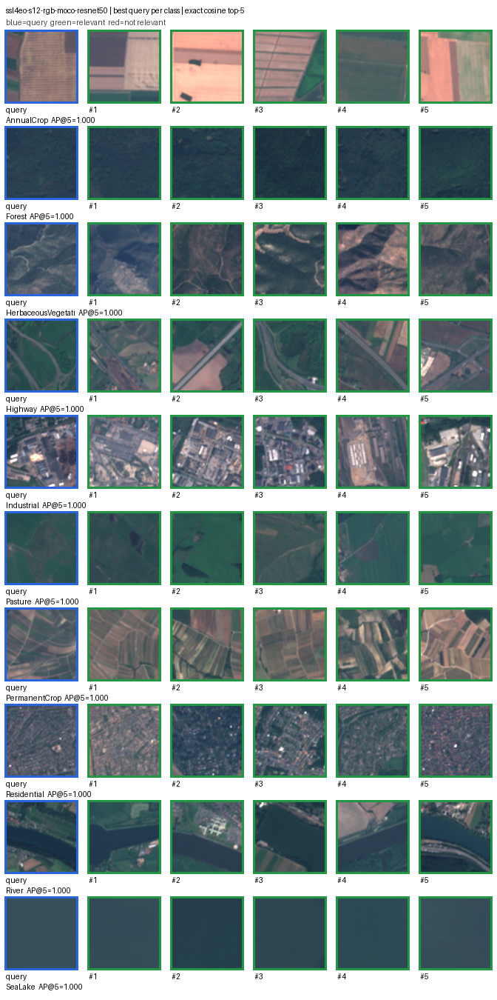

# EuroSAT v1: SSL4EO-S12 band ablation

## Question

Since [ADR 0003](../decisions/0003-ssl4eo-s12-multispectral-encoder.md), this project has reported
that frozen 13-band SSL4EO-S12 outperformed both RGB baselines on EuroSAT v1, while stating that
the result "does not by itself prove that non-visible bands caused the difference". The 13-band run
changed the pretraining domain, the architecture, and the input bands all at once relative to
DINOv2, so no part of its advantage could be attributed.

[ADR 0009](../decisions/0009-confirmatory-model-roster.md) added the SSL4EO-S12 **RGB** MoCo
ResNet-50 checkpoint, which shares the 13-band model's architecture and pretraining corpus. Running
it over the same patches isolates the input bands as the only difference.

## Outcome

Most of SSL4EO-S12's advantage over DINOv2 does **not** come from the extra bands.

| Model | Input | P@10 | R@10 | mAP@10 | nDCG@10 |
|---|---|---:|---:|---:|---:|
| SSL4EO-S12 MoCo, 13-band | 13-band L1C | 0.85300 | 0.05331 | **0.81360** | 0.86472 |
| SSL4EO-S12 MoCo, RGB | B04/B03/B02 | 0.80300 | 0.05019 | **0.74452** | 0.81546 |
| DINOv2 ViT-S/14 | RGB | 0.69475 | 0.04342 | 0.60763 | 0.70545 |
| PCA-64 | RGB | 0.30150 | 0.01884 | 0.19698 | 0.31013 |

All four evaluated 400 queries with none skipped.

Decomposing the 13-band model's `+0.20596` mAP@10 advantage over DINOv2:

| Component | Difference | Share | Controlled |
|---|---:|---:|---|
| Extra ten bands | `+0.06907` | 34% | **Yes** — same architecture, pretraining, patches, split, relevance, ranker |
| RGB representation | `+0.13689` | 66% | No — differs in pretraining domain *and* architecture |

The band contribution is real but is the minority term. The larger share comes from the RGB
representation itself, and that comparison confounds EO-domain pretraining with a ResNet-50 versus
ViT-S/14 architecture change. **This experiment does not isolate pretraining domain.** It isolates
bands only.

## Per-class effect of the extra bands

| Class | RGB mAP@10 | 13-band mAP@10 | Bands contribute |
|---|---:|---:|---:|
| River | 0.5182 | 0.7219 | **+0.2038** |
| PermanentCrop | 0.5159 | 0.6987 | +0.1828 |
| AnnualCrop | 0.6587 | 0.7662 | +0.1075 |
| Pasture | 0.7618 | 0.8364 | +0.0746 |
| Forest | 0.8872 | 0.9540 | +0.0668 |
| Residential | 0.8720 | 0.9242 | +0.0522 |
| Industrial | 0.8914 | 0.9093 | +0.0179 |
| HerbaceousVegetation | 0.7707 | 0.7749 | +0.0042 |
| Highway | 0.5921 | 0.5947 | +0.0026 |
| SeaLake | 0.9771 | 0.9555 | **−0.0216** |

The ordering is physically coherent, which is worth stating because it is a check on the
experiment rather than a claim about the world. The bands help most on `River`, `PermanentCrop`,
and `AnnualCrop` — water-versus-vegetation and crop-type distinctions, where near-infrared and
short-wave infrared carry information the visible bands do not. They barely move `Highway` and
`HerbaceousVegetation`.

`SeaLake` is the one class where the extra bands **hurt**, by a small margin. Open water is already
close to trivially separable in RGB, at 0.9771; the additional channels appear to add variation
without adding discriminative signal. This is reported because it is what the run produced, not
because it is convenient.

## Qualitative inspection

Green borders mark same-class results, red borders mark different-class results, and blue marks the
query. Each grid selects one query per class by AP@5; these are distribution endpoints, not extra
aggregate evidence.




The worst cases are the informative ones. The RGB variant's `River` query returns built-up scenes
at AP@5 0.000: in visible light a river reads as a dark linear feature much like a road or a
shadowed street. That is the confusion the near- and short-wave infrared bands resolve, and `River`
is exactly where the 13-band model gains most (+0.2038). Compare the
[13-band grids](eurosat-v1.md#ssl4eo-s12-best-cases) on the same split.

## Evidence boundary

- EuroSAT v1 is a **regression and development benchmark**. It has already informed project
  decisions, so this is development evidence and never confirmatory. See
  [ADR 0006](../decisions/0006-confirmatory-evaluation-data.md).
- The result speaks to EuroSAT v1's ten classes, its geography, and its single-label relevance
  proxy. It does not establish that ten extra bands contribute roughly a third of the benefit on
  any other dataset, task, or label scheme.
- Both SSL4EO runs deviate identically from torchgeo's registered transform, which divides by
  10000 without clipping while this project also clips to 0–10000. The deviation is shared, so the
  ablation is unaffected. On EuroSAT it is very nearly inert; see [validation](../validation.md).
- No published result changed. This adds a fourth EuroSAT result file; the existing three are
  untouched.

## Reproduce

```powershell
eovr embed-ssl4eo `
  --manifest data/eurosat-v1/manifest.jsonl `
  --archive data/downloads/EuroSAT_MS.zip `
  --checkpoint data/models/resnet50_sentinel2_rgb_moco-2b57ba8b.pth `
  --variant rgb `
  --output artifacts/eurosat-v1-ssl4eo-s12-rgb-moco-resnet50.npz

eovr evaluate `
  --embeddings artifacts/eurosat-v1-ssl4eo-s12-rgb-moco-resnet50.npz `
  --k 10 `
  --output docs/results/eurosat-v1-ssl4eo-s12-rgb-moco-resnet50-k10.json
```

Machine-readable metrics: [RGB variant](eurosat-v1-ssl4eo-s12-rgb-moco-resnet50-k10.json) beside
the existing [13-band](eurosat-v1-ssl4eo-s12-moco-resnet50-k10.json),
[DINOv2](eurosat-v1-dinov2-vits14-k10.json), and [PCA-64](eurosat-v1-pca-64-k10.json) results.
