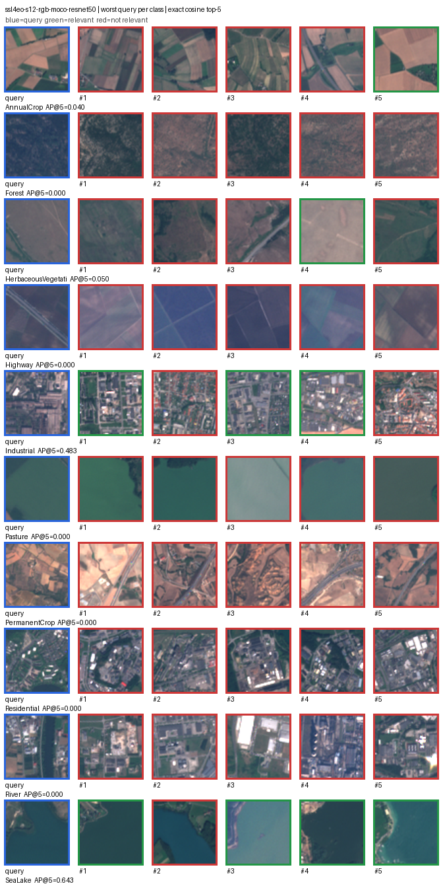
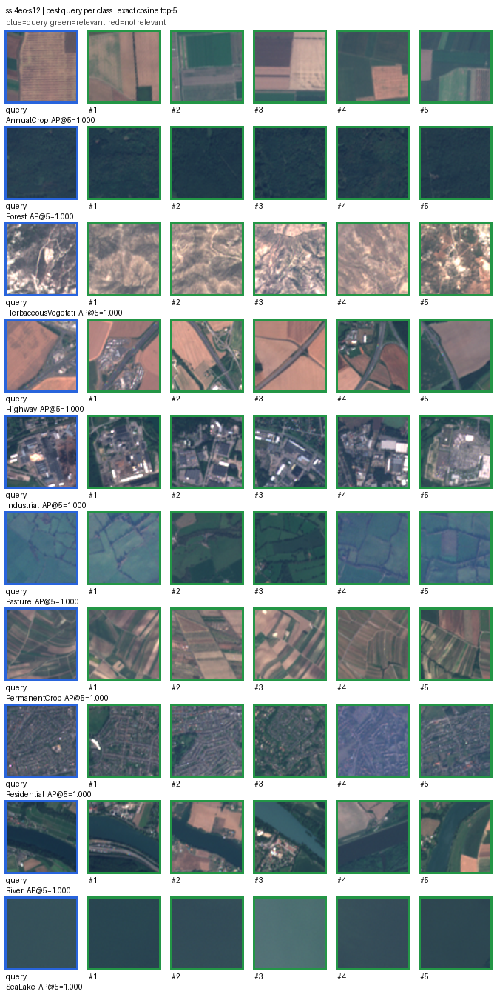
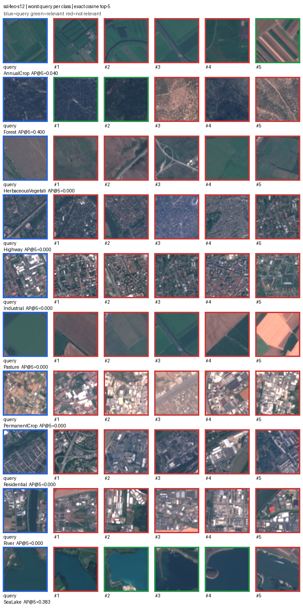
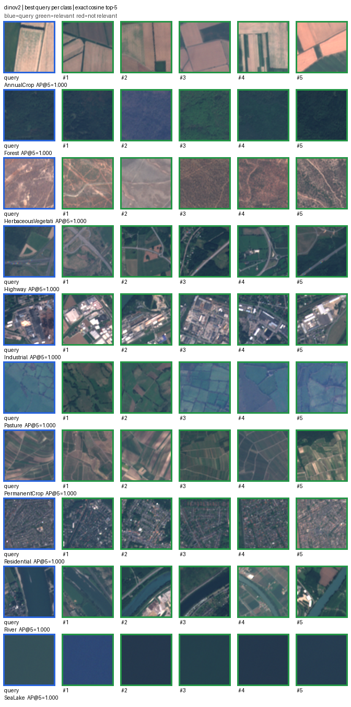
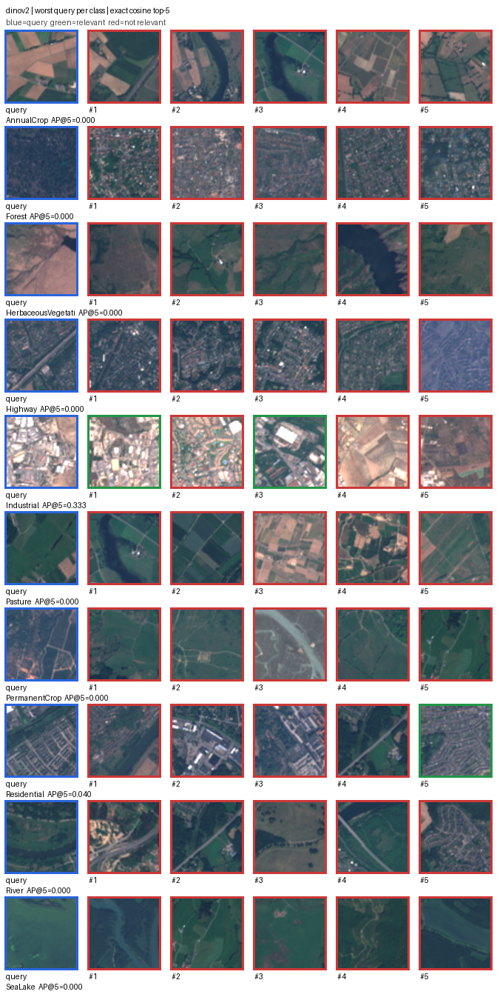
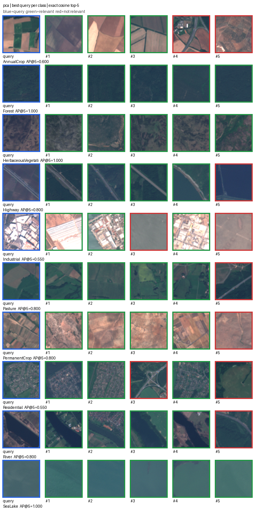
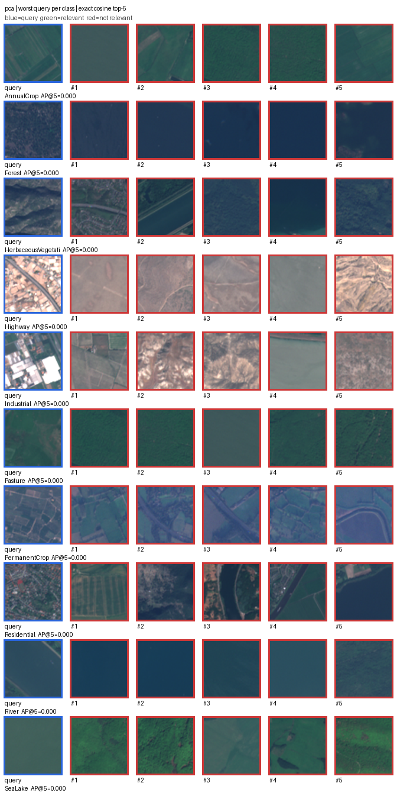

# EuroSAT v1 benchmark results

## Outcome

Frozen 13-band SSL4EO-S12 produced the strongest exact-retrieval result on the unchanged,
spatially separated EuroSAT v1 split. It exceeded frozen RGB DINOv2 in every aggregate metric and
in per-class mAP@10 for all 10 classes. DINOv2 still substantially outperformed flattened-pixel
PCA, preserving the original classical-versus-modern RGB finding.

A fourth model was added later under [ADR 0009](../decisions/0009-confirmatory-model-roster.md):
the same SSL4EO-S12 encoder restricted to RGB. It exists to attribute the 13-band model's
advantage, not to compete for the top row.

| Model | Input | P@10 | R@10 | mAP@10 | nDCG@10 | Queries | Skipped |
|---|---|---:|---:|---:|---:|---:|---:|
| PCA-64 | RGB | 0.3015 | 0.01884 | 0.19698 | 0.31013 | 400 | 0 |
| DINOv2 ViT-S/14 | RGB | 0.69475 | 0.04342 | 0.60763 | 0.70545 | 400 | 0 |
| SSL4EO-S12 MoCo ResNet-50 | RGB | 0.80300 | 0.05019 | 0.74452 | 0.81546 | 400 | 0 |
| SSL4EO-S12 MoCo ResNet-50 | 13-band | **0.8530** | **0.05331** | **0.81360** | **0.86472** | 400 | 0 |

Recall looks numerically small because every query has 160 relevant index images while only 10
results can be returned. The maximum possible R@10 is therefore `10 / 160 = 0.0625`. SSL4EO-S12's
P@10 corresponds to 8.53 relevant results in the average top 10, compared with 6.9475 for DINOv2
and 3.015 for PCA. Relative to DINOv2, SSL4EO-S12 improved P@10 by 0.15825 and mAP@10 by 0.20596.

Machine-readable results:

- [PCA-64 metrics](eurosat-v1-pca-64-k10.json)
- [DINOv2 ViT-S/14 metrics](eurosat-v1-dinov2-vits14-k10.json)
- [SSL4EO-S12 13-band metrics](eurosat-v1-ssl4eo-s12-moco-resnet50-k10.json)
- [SSL4EO-S12 RGB metrics](eurosat-v1-ssl4eo-s12-rgb-moco-resnet50-k10.json)

## What the extra bands actually contributed

The RGB variant shares the 13-band model's architecture and pretraining corpus, so the pair is a
controlled band comparison. The extra ten bands account for `+0.06907` mAP@10 — **34%** of the
`+0.20596` advantage the 13-band model holds over DINOv2. The remaining two thirds belongs to the
RGB representation, and that comparison still confounds EO-domain pretraining with a ResNet-50
versus ViT-S/14 architecture change.

Read [the band ablation](eurosat-v1-ssl4eo-band-ablation.md) before attributing this benchmark's
multispectral result to spectral information. The bands help `River` (+0.2038) and `PermanentCrop`
(+0.1828) substantially, barely move `Highway` (+0.0026), and are slightly harmful on `SeaLake`
(−0.0216).

## Per-class comparison

| Class | PCA mAP@10 | DINOv2 mAP@10 | SSL4EO mAP@10 | SSL4EO − DINOv2 |
|---|---:|---:|---:|---:|
| AnnualCrop | 0.1551 | 0.5616 | 0.7662 | +0.2046 |
| Forest | 0.5040 | 0.8685 | 0.9540 | +0.0856 |
| HerbaceousVegetation | 0.1729 | 0.5822 | 0.7749 | +0.1928 |
| Highway | 0.0675 | 0.4037 | 0.5947 | +0.1911 |
| Industrial | 0.1542 | 0.8542 | 0.9093 | +0.0551 |
| Pasture | 0.2420 | 0.5771 | 0.8364 | +0.2593 |
| PermanentCrop | 0.0958 | 0.4116 | 0.6987 | +0.2872 |
| Residential | 0.0509 | 0.7715 | 0.9242 | +0.1527 |
| River | 0.1238 | 0.2744 | 0.7219 | +0.4475 |
| SeaLake | 0.4036 | 0.7715 | 0.9555 | +0.1840 |

SSL4EO-S12's strongest mAP@10 classes were `SeaLake` (0.9555) and `Forest` (0.9540). `Highway`
remained its weakest class at 0.5947. The largest improvement over DINOv2 was on `River` (+0.4475),
consistent with multispectral surface information helping this representation distinguish water
and vegetation, although this benchmark cannot attribute the gain to particular bands.

## Qualitative inspection

Green borders mark same-class results, red borders mark different-class results, and blue marks
the query. Each grid selects one query per class by AP@5; these are distribution endpoints, not
additional aggregate evidence.

### SSL4EO-S12 RGB variant

The RGB variant's failures show what the extra bands buy. Its worst `River` query returns built-up
scenes at AP@5 0.000: in visible light a river reads as a dark linear feature much like a road or
a shadowed street, and the near- and short-wave infrared bands that separate water from asphalt are
absent. `Pasture` and `PermanentCrop` fail into other vegetated and agricultural classes for the
same reason. Its best cases are in
[the ablation results](eurosat-v1-ssl4eo-band-ablation.md).

### SSL4EO-S12 best cases

Every selected best case retrieved five same-class results. The model grouped visibly varied crop,
built, forest, river, and open-water scenes even though ranking used the full multispectral source
rather than the RGB rendering shown here.

### SSL4EO-S12 failure cases

The worst rows show meaningful confusion rather than uniformly perfect retrieval. Atypical
agricultural scenes cross crop labels; highway and industrial queries can favor other built areas;
and the worst residential and river queries retrieve visually plausible neighboring classes. This
also exposes the mismatch between broad EuroSAT labels and some notions of visual similarity.

### DINOv2 best cases

All selected best cases retrieved five same-class results. The rows show that DINOv2 can group
recognizable field geometry, forest texture, transport structure, dense built form, waterways,
and open water across separated locations.

### DINOv2 failure cases

Failure rows remain important despite the strong average. Visually mixed or atypical patches can
be ranked with a plausible neighboring class: agricultural mosaics resemble other crop classes,
thin rivers compete with vegetated or road-like structure, and built classes overlap where a patch
contains both settlement and industry. Some failures may also expose the limits of one broad class
label as the relevance definition rather than purely model error.

### PCA best and worst cases

PCA succeeds when dominant color and coarse texture are distinctive, especially for forest and
open water. Its worst rows show why pixel variance is a limited semantic representation: similar
color palettes can connect unrelated land-use classes, while the same class can vary greatly in
layout and appearance.

## Reproducibility evidence

| Property | Executed value |
|---|---|
| Source | Official EuroSAT multispectral archive, DOI `10.5281/zenodo.7711810` |
| Archive integrity | 2,065,402,329 bytes; MD5 `091174add3c8e680a49244acf185b9f0` |
| Discovered patches | 27,000 |
| Selected set | 1,600 index + 400 query; 160/40 per class |
| Spatial policy | Disjoint 50 km EPSG:6933 cells plus 5 km geodesic guard band |
| Observed minimum separation | 5.06623 km |
| Represented spatial groups | 725 |
| Verified RGB file hashes | 2,000 |
| Manifest SHA-256 | `bc0b10bf3e3cf29d7f7732529ce5f419b514e2ded3a5e2a5e6e88ebcdea45338` |
| Python | 3.11.5 |
| PCA | 64 components, 64×64 RGB, fitted on index only; scikit-learn 1.9.0 |
| DINOv2 | `dinov2_vits14`, 224×224 RGB, frozen 384-d vectors; PyTorch 2.13.0 CPU |
| SSL4EO-S12 | MoCo ResNet-50, 13-band L1C, frozen 2,048-d vectors; checkpoint SHA-256 `df8b932e2a23a0773febedf3f650aa7d342b805f7876ca5ed6b139d7245d7c09` |
| Ranking | Exact cosine similarity |
| Relevance | Binary EuroSAT class agreement |

All three stores contain identical ordered IDs, labels, splits, and manifest hashes. SSL4EO-S12
embedding generation took 126.87 seconds on the recorded CPU environment. Its vector norms ranged
from 0.99999976 to 1.00000012; no throughput claim is inferred from this single run.

## Evidence boundary

This result supports two narrow claims: under the recorded EuroSAT v1 spatial split and binary
class relevance, frozen RGB DINOv2 ranks same-class images substantially better than PCA-64, and
frozen 13-band SSL4EO-S12 ranks them better than both RGB representations.

It does **not** establish temporal or seasonal generalization because EuroSAT does not expose
acquisition timestamps. It also does not isolate the contribution of extra bands from EO-specific
pretraining, rule out model-pretraining geography overlap, establish transfer to another dataset,
or demonstrate analyst usefulness, online latency, or production readiness. Best/worst examples
were chosen after evaluation and must not be treated as representative averages.
