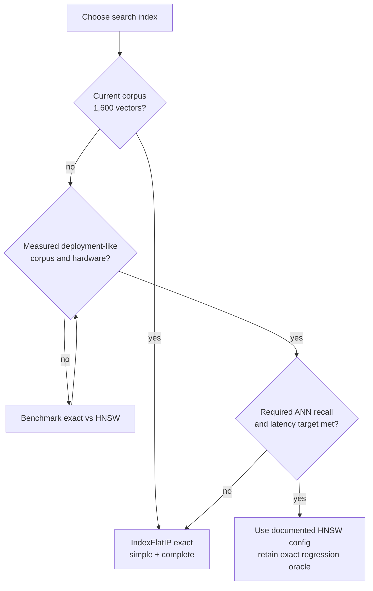

# Faiss exact-versus-HNSW v1 results

## Result in one sentence

Keep exact search for the current 1,600-vector corpus: HNSW adds construction and graph storage,
and it was slower for DINOv2 and SSL4EO-S12. At 50k synthetic DINOv2 vectors, low-effort HNSW
became faster only by giving up part of the exact top-10 ranking.

## Decision flow

## Environment and protocol

- Windows 10 build 26200, Python 3.11.5
- `faiss-cpu 1.15.0`, NumPy 2.4.6, psutil 7.2.2
- one CPU thread, 400 real query vectors, `k=10`
- HNSW `M=32`, `efConstruction=200`, `efSearch ∈ {16,32,64,128}`
- two warmup batches and seven measured batches
- latency is batch duration divided by query count

Timing is an observation for this machine and workload, not a production SLA.

## Real 1,600-vector corpora

| Representation | Dim. | Exact median ms/query | HNSW efSearch | ANN recall@10 | HNSW median ms/query | Speedup vs exact |
|---|---:|---:|---:|---:|---:|---:|
| PCA-64 | 64 | 0.01227 | 16 | 0.92950 | 0.00652 | 1.88× |
| PCA-64 | 64 | 0.01227 | 32 | 0.96475 | 0.01114 | 1.10× |
| PCA-64 | 64 | 0.01227 | 64 | 0.98150 | 0.02113 | 0.58× |
| PCA-64 | 64 | 0.01227 | 128 | 0.99075 | 0.04479 | 0.27× |
| DINOv2 ViT-S/14 | 384 | 0.00687 | 16 | 0.97400 | 0.01286 | 0.53× |
| DINOv2 ViT-S/14 | 384 | 0.00687 | 32 | 0.99675 | 0.02191 | 0.31× |
| DINOv2 ViT-S/14 | 384 | 0.00687 | 64 | 0.99975 | 0.03661 | 0.19× |
| DINOv2 ViT-S/14 | 384 | 0.00687 | 128 | 1.00000 | 0.06729 | 0.10× |
| SSL4EO-S12 | 2,048 | 0.01722 | 16 | 0.99475 | 0.03684 | 0.47× |
| SSL4EO-S12 | 2,048 | 0.01722 | 32 | 0.99950 | 0.05968 | 0.29× |
| SSL4EO-S12 | 2,048 | 0.01722 | 64 | 1.00000 | 0.08427 | 0.20× |
| SSL4EO-S12 | 2,048 | 0.01722 | 128 | 1.00000 | 0.14508 | 0.12× |

PCA at low `efSearch` is the only real tier where HNSW was faster, but it omitted about 7.1% of
the exact top-10 neighbors. The strongest semantic representation, SSL4EO-S12, received no latency
benefit from HNSW at this corpus size.

## DINOv2 scale experiment

| Corpus | Real / synthetic | Exact ms/query | efSearch | ANN recall@10 | HNSW ms/query | Speedup |
|---:|---|---:|---:|---:|---:|---:|
| 1,600 | Real | 0.00687 | 16 | 0.97400 | 0.01286 | 0.53× |
| 1,600 | Real | 0.00687 | 32 | 0.99675 | 0.02191 | 0.31× |
| 1,600 | Real | 0.00687 | 64 | 0.99975 | 0.03661 | 0.19× |
| 1,600 | Real | 0.00687 | 128 | 1.00000 | 0.06729 | 0.10× |
| 10,000 | Synthetic expansion | 0.02420 | 16 | 0.95575 | 0.02472 | 0.98× |
| 10,000 | Synthetic expansion | 0.02420 | 32 | 0.98600 | 0.02995 | 0.81× |
| 10,000 | Synthetic expansion | 0.02420 | 64 | 0.99550 | 0.05988 | 0.40× |
| 10,000 | Synthetic expansion | 0.02420 | 128 | 1.00000 | 0.11057 | 0.22× |
| 50,000 | Synthetic expansion | 0.11755 | 16 | 0.85175 | 0.05705 | **2.06×** |
| 50,000 | Synthetic expansion | 0.11755 | 32 | 0.91475 | 0.08071 | **1.46×** |
| 50,000 | Synthetic expansion | 0.11755 | 64 | 0.97625 | 0.12289 | 0.96× |
| 50,000 | Synthetic expansion | 0.11755 | 128 | 0.99475 | 0.22408 | 0.52× |

The 50k tier shows the intended HNSW curve: less graph exploration is faster but misses more exact
neighbors; more exploration approaches exact recall and consumes the latency advantage. There is
no universally correct `efSearch`; it must be selected from a product's quality and latency
requirements.

## Build and storage cost

| Workload | Exact build | HNSW build | Exact serialized | HNSW serialized |
|---|---:|---:|---:|---:|
| PCA, 1,600 × 64 | 0.00018 s | 0.0677 s | 0.39 MiB | 0.81 MiB |
| DINOv2, 1,600 × 384 | 0.00080 s | 0.1207 s | 2.34 MiB | 2.76 MiB |
| SSL4EO, 1,600 × 2,048 | 0.00408 s | 0.3681 s | 12.50 MiB | 12.91 MiB |
| DINOv2, 10,000 × 384 synthetic | 0.00381 s | 1.4971 s | 14.65 MiB | 17.24 MiB |
| DINOv2, 50,000 × 384 synthetic | 0.01436 s | 18.6080 s | 73.24 MiB | 86.22 MiB |

HNSW stores the original vectors plus graph links, so it is larger than `IndexFlatIP`. The 50k
HNSW build took roughly 18.6 seconds versus 0.014 seconds for Flat in this run. That upfront cost
must be amortized across enough searches or justified by an online latency requirement.

RSS deltas are present in the raw JSON but are not promoted into the main table: native allocator
reuse made these process-level differences noisy. Serialized byte counts are the clearer storage
comparison.

## What this proves

- The code can construct, query, measure, and serialize exact and HNSW Faiss indexes.
- HNSW recall is evaluated against exact neighbor IDs, not against class labels.
- Exact search is the evidence-backed choice for the current 1,600-item project surface.
- The 50k synthetic workload exhibits a measurable speed/recall trade-off.

## What this does not prove

- that 50k perturbed copies behave like 50k real EO observations;
- production throughput or tail latency under concurrent traffic;
- performance on Linux, GPU, cloud, or another CPU;
- that a particular ANN recall loss is acceptable to users;
- update, deletion, metadata-filter, or persistence-reload behavior;
- a semantic-quality improvement—approximation cannot improve the underlying representation.

## Machine-readable evidence

- [PCA real 1,600](faiss-v1-pca-1600.json)
- [DINOv2 real 1,600](faiss-v1-dinov2-1600.json)
- [SSL4EO-S12 real 1,600](faiss-v1-ssl4eo-1600.json)
- [DINOv2 synthetic 10,000](faiss-v1-dinov2-10000-synthetic.json)
- [DINOv2 synthetic 50,000](faiss-v1-dinov2-50000-synthetic.json)

