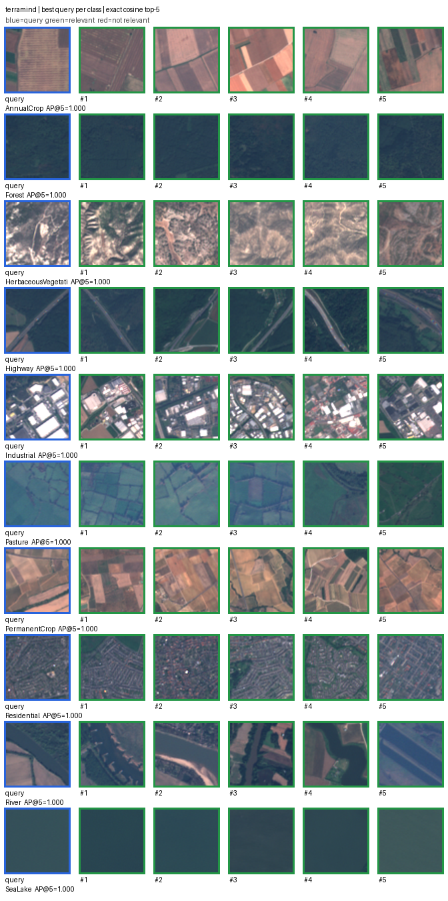
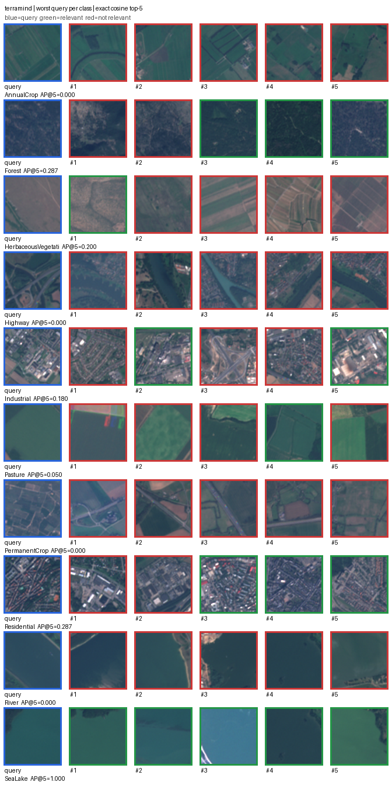

# TerraMind-Tiny regression results — 2026-09-02

## Decision

**Keep SSL4EO-S12 as the primary multispectral reference.** Frozen TerraMind-Tiny exceeded the
existing DINOv2 RGB result but did not match SSL4EO on the same 400 EuroSAT v1 queries. Retain
TerraMind as a compact alternative, not a default replacement.

This is a successful experiment even though the newer model did not win. Model reputation,
downstream benchmark scores, and a product database cannot replace task-specific measurement.

## Aggregate evidence

| Representation | Dimensions | P@10 | R@10 | mAP@10 | nDCG@10 |
|---|---:|---:|---:|---:|---:|
| PCA-64, previous reference | 64 | 0.30150 | 0.01884 | 0.19698 | 0.31013 |
| DINOv2 ViT-S/14, previous RGB reference | 384 | 0.69475 | 0.04342 | 0.60763 | 0.70545 |
| SSL4EO-S12, selected multispectral reference | 2048 | 0.85300 | 0.05331 | 0.81360 | 0.86472 |
| TerraMind-Tiny, new frozen challenger | 192 | 0.75075 | 0.04692 | 0.68688 | 0.76807 |

The new run evaluated all 400 queries and skipped none. Its mAP was 0.07925 above DINOv2 and
0.12671 below SSL4EO. These are observed differences, not statistical-significance claims.
Earlier results are from [EuroSAT v1](eurosat-v1.md); the new full-precision metrics, per-class
values, hashes, and runtime metadata are in [terramind-v1.json](terramind-v1.json).

At float32, a 192-d vector has 90.625% fewer payload bytes than a 2,048-d vector. This is a
representation-storage trade-off, not a measured total-index RAM reduction or latency result.

### Per-class mAP@10

| Class | SSL4EO-S12 | TerraMind-Tiny |
|---|---:|---:|
| AnnualCrop | 0.76617 | 0.47813 |
| Forest | 0.95401 | 0.94442 |
| HerbaceousVegetation | 0.77493 | 0.60080 |
| Highway | 0.59472 | 0.26806 |
| Industrial | 0.90932 | 0.89167 |
| Pasture | 0.83643 | 0.86398 |
| PermanentCrop | 0.69875 | 0.51519 |
| Residential | 0.92420 | 0.81236 |
| River | 0.72194 | 0.49699 |
| SeaLake | 0.95551 | 0.99725 |

TerraMind improved Pasture and SeaLake, while the largest observed weaknesses relative to SSL4EO
were Highway and AnnualCrop. One aggregate score hides these task-specific differences.

## Integrity checks

- The ordered item IDs, labels, index/query assignments, and manifest SHA-256 matched all three
  existing representation stores.
- All 2,000 vectors were finite. Norms ranged from 0.9999998212 to 1.0000001192.
- The pinned checkpoint matched its published SHA-256. Every required backbone key and shape
  matched; unused decoder/modality parameters were excluded, not replaced with random values.
- The fixed [preprocessing/pooling protocol](../benchmark-terramind.md) ran without tuning on
  the results. No neural-network weights were updated.
- MLflow recorded the aggregate evaluation locally under run
  `6c61330ad7dd477abe166848d763d7b0`; no imagery or vectors were uploaded.
- Embedding used Python 3.11.5, TerraTorch 1.2.11, PyTorch 2.13.0+cu130, float32, batch size 2,
  and the 4 GB RTX 3050 Laptop GPU.

The embedding command took 41.983 seconds including process startup, imports, archive/checkpoint
checks, inference, and saving. Do not compare this with earlier CPU command timings as a model
speedup: hardware, caching, and measurement boundaries differ.

## Qualitative inspection

These are deterministic **best/worst AP@5 selections**, not representative random samples or
additional k=10 aggregate evidence. Blue borders mark queries; green/red mark class-label
agreement/disagreement. They are display derivatives of the public EuroSAT inputs, not raw data.

The best example from every class achieved AP@5=1.0. The worst Highway example achieved 0.0 even
though its best example retrieved obvious linear road scenes correctly. Worst AnnualCrop,
PermanentCrop, and River examples also had no same-class top-five results. Several false matches
look visually plausible, reinforcing that broad class labels are only a relevance proxy.

## What follows

Do not spend further time trying to make this one model win the already-inspected benchmark.
The next priority is a bounded new dataset with multi-label relevance, geographic and available
temporal separation, development queries for tuning, and an untouched final holdout. Evaluate
compact representations and product-store trade-offs on that protocol.

These results do not establish universal model superiority, isolate architectural or spectral
causes, validate geographic/pretraining independence, or prove production user relevance.
