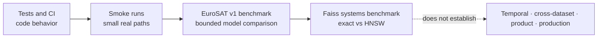

# Validation record

## Evidence policy

This file records executed checks. A passing smoke run proves that a path operates under the
recorded conditions; it does not prove representative retrieval quality, generalization, or
production readiness.

Update this record only after executing the relevant validation. Keep planned work in
`docs/project-context.md`.



The first three boxes record different kinds of evidence; passing one does not imply the next.
See [Understanding the benchmarks](learning-benchmarks.md) for the evidence ladder and the exact
training boundary.

## Evaluation foundations — 2026-09-02

Executed on the isolated `codex/evaluation-foundations` branch:

| Gate | Executed evidence | Status |
|---|---|---|
| Lockfile | `uv 0.12.9`; `uv lock --check`; 234 resolved package variants | Passed |
| Fresh Windows Python 3.11.5 | Locked dev/geo/search environment; 41 tests; Ruff | Passed |
| Fresh Windows Python 3.12.1 | Locked dev/geo/search environment; 41 tests | Passed |
| Dependency consistency | `uv pip check` in both validation environments; original CPU `pip check` | Passed |
| Coverage | 41 tests, 68% total; local tracking module 91% | Passed; no minimum enforced |
| Local MLflow | MLflow 3.15.2, local SQLite and inspected aggregate-only artifact | Passed |
| Tracked SSL4EO regression | Existing store, 400 queries, zero skipped, mAP@10 0.8135958333 | Reproduced |
| Optuna availability | Optuna 4.9.0; eight seeded synthetic scalar-objective trials | Smoke only, no retrieval tuning |
| GitHub vulnerability alerts | Enabled via API; subsequent status returned successfully | Enabled, not a clean vulnerability audit |
| TerraMind checkpoint | Public pinned revision, 211,873,402 bytes, SHA-256 matched published LFS identity | Passed |

The tracked SSL4EO store hash was
`4a0b54291346ab9a9ec12570759c5c36365f0011b6aade09400101dcacf63b07` and local MLflow run ID was
`73daf4bdef5f42e3b28a166b72e4ddcd`. Its artifact contained aggregate metrics and allowlisted
content identities only: no image IDs, labels, vectors, imagery, or provider URLs.

The original CPU environment and original embedding stores were not replaced. Remote CI run
`33657731176` passed all four Linux/Windows, Python 3.11/3.12 jobs for commit `e1244da`.
TerraMind's separate executed regression result is recorded below; it is not implied merely by
passing the foundation/tooling gates.

The first foundation install hit a missing Python 3.11 Windows wheel for `stringzilla 5.1.2`.
The lock now constrains that platform to 5.1.1; no C++ build tools were installed.

### CPU/CUDA correctness smoke

The isolated GPU profile installed 201 compatible packages, including PyTorch `2.13.0+cu130`,
torchvision `0.28.0+cu130`, and TerraTorch `1.2.11`. `uv pip check` passed. The GPU was an NVIDIA
RTX 3050 Laptop with 4 GB VRAM and driver 610.74.

`scripts/validate_gpu.py` processed 40 existing EuroSAT records (two per class and split) using the
same verified SSL4EO weights on CPU and CUDA, batch size 2, four CPU threads, float32, with TF32
disabled. The maximum absolute vector difference was `2.5779008865356445e-6`; minimum paired
cosine was `0.9999998807907104`. All CUDA vectors were finite and unit-normalized. The declared
`rtol=1e-4`, `atol=1e-5` parity gate passed. Full sanitized evidence is in
[gpu-parity-v1.json](results/gpu-parity-v1.json).

The measured 36.405 s CPU and 4.949 s CUDA totals include imports/model loading, archive/checkpoint
checksum reads, and cold/warm filesystem effects. They do **not** establish a GPU throughput
speedup. This smoke establishes numerical agreement for the sampled SSL4EO path only.

### Frozen TerraMind-Tiny EuroSAT regression

The pinned Tiny checkpoint generated 2,000 192-dimensional float32 vectors on CUDA. Required
backbone keys/shapes loaded strictly, and ordered IDs, labels, splits, and manifest SHA matched
the PCA, DINOv2, and SSL4EO stores. All vectors were finite and unit-normalized within tolerance.

At k=10, all 400 queries were evaluated with zero skipped: P@10 `0.75075`, R@10 `0.046921875`,
mAP@10 `0.6868842262`, nDCG@10 `0.7680690406`. This exceeded the existing DINOv2 result but did not
match SSL4EO's `0.8135958333` mAP. SSL4EO remains the selected multispectral reference; TerraMind is
a compact alternative, not a promoted default. The inspected best/worst AP@5 grids, per-class
results, complete hashes, configuration, and timing caveats are in
[TerraMind v1 results](results/terramind-v1.md) and its machine-readable JSON.

EuroSAT v1 has already informed decisions and is a regression/development benchmark, not a fresh
confirmatory holdout. No new cross-dataset or temporal generalization claim is made.

## Previous code-health baseline — 2026-09-02

Executed locally before the evaluation-foundations phase with Python 3.11.5:

| Gate | Command or evidence | Status |
|---|---|---|
| Static quality | `python -m ruff check .` | Passed |
| Unit tests | `python -m pytest` | 29 passed |
| Dependency consistency | `python -m pip check` | Passed |
| Coverage report | `pytest --cov=eo_visual_retrieval --cov-report=term-missing` | 59% total |
| Current-source import | `eo_visual_retrieval.__file__` resolved under this checkout's `src/` | Passed |
| GitHub CI | Ruff and tests on Python 3.11 and 3.12 for commit `1b851ca` | Passed |

Coverage is strongest in EuroSAT preparation/audit, visualization, manifests, storage, exact
retrieval, Faiss benchmark logic, records, evaluation, SSL4EO input preparation, and the pure chip-processing path. The
CLI, PCA, and DINOv2 modules do not yet have direct unit coverage; STAC network resolution is only
partially covered. CI reports coverage but does not enforce a minimum percentage.

## Spatially separated EuroSAT v1 benchmark — updated 2026-09-02

The official EuroSAT multispectral archive was downloaded from DOI `10.5281/zenodo.7711810` and
verified before preparation.

### Dataset and split audit

| Gate | Executed evidence | Status |
|---|---|---|
| Archive identity | 2,065,402,329 bytes; MD5 `091174add3c8e680a49244acf185b9f0` | Passed |
| Source discovery | 27,000 georeferenced multispectral patches | Passed |
| Selected benchmark | 1,600 index + 400 query; 160/40 for each of 10 classes | Passed |
| Spatial groups | 725 represented groups; no 50 km EPSG:6933 cell crossed the split | Passed |
| Guard band | Observed minimum great-circle index/query centroid distance 5.06623 km | Passed |
| File integrity | All 2,000 selected RGB SHA-256 values recomputed successfully | Passed |
| Manifest identity | SHA-256 `bc0b10bf3e3cf29d7f7732529ce5f419b514e2ded3a5e2a5e6e88ebcdea45338` | Passed |
| Model alignment | Ordered IDs, labels, splits, and manifest SHA matched across all three stores | Passed |
| Vector normalization | PCA, DINOv2, and SSL4EO-S12 vector norms were approximately 1.0 | Passed |
| SSL4EO checkpoint | 94,487,109 bytes; SHA-256 `df8b932e2a23a0773febedf3f650aa7d342b805f7876ca5ed6b139d7245d7c09` | Passed |

### Exact-retrieval results at k=10

All 400 queries were evaluated and none were skipped.

| Model | P@10 | R@10 | mAP@10 | nDCG@10 |
|---|---:|---:|---:|---:|
| PCA-64 | 0.3015 | 0.01884 | 0.19698 | 0.31013 |
| DINOv2 ViT-S/14 | 0.69475 | 0.04342 | 0.60763 | 0.70545 |
| SSL4EO-S12 MoCo ResNet-50 | 0.8530 | 0.05331 | 0.81360 | 0.86472 |

PCA used 64 components fitted only on the 1,600 index items. DINOv2 used frozen
`dinov2_vits14` features and produced 384-dimensional vectors. Both ranked the same index with
exact cosine similarity. Execution used Python 3.11.5 and PyTorch 2.13.0 CPU; xFormers was not
available, so no acceleration or throughput claim is made.

SSL4EO-S12 read the same 2,000 selected patches from the 13-band source archive, reordered `B8A`
to the checkpoint's expected position, applied the registered clipping/scaling and 224-pixel crop,
and produced frozen 2,048-dimensional vectors. Generation took 126.87 seconds on CPU. Its norm
range was 0.99999976–1.00000012. The aggregate and per-class scores exceeded DINOv2, but this run
changes both pretraining domain and model input bands; it is not an extra-band ablation.

Per-class metrics and inspected best/worst AP@5 grids are recorded in
`docs/results/eurosat-v1.md`, with machine-readable k=10 results under `docs/results/`.

## Faiss exact-versus-HNSW benchmark — 2026-09-02

Executed on Windows 10 build 26200 with Python 3.11.5, `faiss-cpu 1.15.0`, one CPU thread, and all
400 EuroSAT v1 queries. Every run used normalized inner product, `k=10`, HNSW `M=32`,
`efConstruction=200`, two warmup batches, and seven measured batches.

### Real 1,600-vector stores

| Store | Exact median ms/query | Selected HNSW observation | Outcome |
|---|---:|---|---|
| PCA-64 | 0.01227 | ef=16: 0.00652 ms, ANN recall 0.92950 | Faster only with 7.1% exact-neighbor loss |
| DINOv2 | 0.00687 | ef=16: 0.01286 ms, ANN recall 0.97400 | HNSW slower |
| SSL4EO-S12 | 0.01722 | ef=16: 0.03684 ms, ANN recall 0.99475 | HNSW slower |

### DINOv2 scale tiers

| Corpus | Provenance | Exact ms/query | HNSW ef=16 | HNSW ef=64 |
|---:|---|---:|---|---|
| 10,000 | 1,600 real + 8,400 synthetic rows | 0.02420 | 0.02472 ms; recall 0.95575 | 0.05988 ms; recall 0.99550 |
| 50,000 | 1,600 real + 48,400 synthetic rows | 0.11755 | 0.05705 ms; recall 0.85175 | 0.12289 ms; recall 0.97625 |

The 50k tier demonstrates a systems trade-off, not EO quality at scale. HNSW build and serialized
size were also larger: 18.608 seconds and 86.22 MiB versus 0.01436 seconds and 73.24 MiB for Flat.
Process RSS deltas were recorded but are treated as approximate because native allocator reuse
affects before/after observations.

The selected current policy is exact search for 1,600 items. Machine-readable evidence and the
full parameter sweep are in `docs/results/faiss-v1-*.json`; interpretation is in
`docs/results/faiss-v1.md`.

## Analysis-ready Sentinel-2 chip smoke validation — 2026-09-01

Executed with Rasterio 1.4.4 against one public Planetary Computer Sentinel-2 L2A item:

```text
S2A_MSIL2A_20240625T185941_R013_T10TET_20240626T030520
```

Requested WGS84 bounds:

```text
[-122.15, 47.60, -122.13, 47.62]
```

| Gate | Evidence | Status |
|---|---|---|
| Windowed COG access | Read `B04`, `B03`, `B02`, and `SCL` through signed in-memory URLs | Passed |
| Grid alignment | 153 × 225 pixels in EPSG:32610 at 10 m | Passed |
| Reflectance output | 3-band float32 GeoTIFF with scale 0.0001 and offset -0.1 | Passed |
| Model RGB output | 3-band uint8 GeoTIFF with fixed 0.0–0.3 reflectance stretch | Passed |
| SCL/nodata mask | 34,293 valid pixels and 132 masked pixels | Passed |
| Manifest sanitization | No HREF, token, or signature text persisted | Passed |
| Reproducibility metadata | CRS, transform, bounds, GSD, policy, baseline, and hashes recorded | Passed |
| DINOv2 bridge | Model-ready GeoTIFF produced one normalized 384-dimensional ViT-S/14 vector | Passed |

Observed valid BOA reflectance ranged from approximately -0.0079 to 0.76. Negative values were
preserved in the reflectance artifact. Values outside the configured 0.0–0.3 display range were
clipped only in the model-ready RGB artifact.

Artifacts remained under ignored local `data/` paths and were not committed.

The DINOv2 bridge ran on CPU without xFormers. The missing xFormers optimization emitted warnings
but did not affect correctness; no acceleration or throughput claim is made.

## External-service and model smoke validation — 2026-08-27

### Environment

- Python 3.11
- PyTorch 2.13.0 CPU build
- torchvision 0.28.0 CPU build
- scikit-learn 1.9.0
- pystac-client 0.9.0
- DINOv2 `dinov2_vits14`

The machine had an NVIDIA RTX 3050 Laptop GPU, but the executed environment used a CPU-only
PyTorch wheel. CUDA acceleration and throughput were not validated.

### Executed gates

| Gate | Evidence | Status |
|---|---|---|
| Public STAC search | Bounded Sentinel-2 L2A query returned 2 items | Passed |
| Manifest sanitization | No HREF, signature, or token fields persisted | Passed |
| Signed materialization | 2 public 343 × 343 RGB preview GeoTIFFs | Passed |
| PCA smoke retrieval | 16 controlled synthetic images, 4-dimensional vectors | Passed |
| DINOv2 smoke retrieval | 16 controlled synthetic images, 384-dimensional vectors | Passed |
| DINOv2 EO smoke | 2 Sentinel-2 previews, 384-dimensional vectors | Passed |

The official ViT-S/14 checkpoint was cached at 88,283,115 bytes with local SHA-256:

```text
B938BF1BC15CD2EC0FEACFE3A1BB553FE8EA9CA46A7E1D8D00217F29AEF60CD9
```

### Smoke observations

- Synthetic PCA and DINOv2 runs produced Precision@3, mAP@3, and nDCG@3 of 1.0. The images were
  deliberately simple color patterns, so these values validate execution only.
- Two same-area Sentinel-2 previews captured five days apart had DINOv2 cosine similarity 0.9416.
  Two images without relevance judgments cannot support a retrieval-quality conclusion.

## Evidence not yet available

- Temporal or seasonal leakage controls; EuroSAT does not expose acquisition timestamps.
- Repeatable performance across other operating systems, CPUs, thread counts, and concurrent load.
- ANN behavior on a genuinely larger EO corpus rather than deterministic synthetic expansion.
- Representative GPU throughput, precision/batch-size sweeps, or cross-hardware performance.
- API, interactive-demo, or deployment validation.

## Allowed claims

The repository may claim that it contains a tested offline retrieval pipeline; that bounded STAC
and analysis-ready Sentinel-2 chip paths have executed; that DINOv2 ViT-S/14 outperformed PCA-64;
and that the frozen 13-band SSL4EO-S12 representation outperformed both RGB baselines on the
recorded spatially separated EuroSAT v1 class-retrieval benchmark. It may also claim that the
recorded one-thread Windows experiment found exact search preferable at 1,600 items and measured a
speed/recall trade-off for HNSW on a 50k synthetic DINOv2 workload. It may also claim that a bounded
40-sample SSL4EO CPU/CUDA numerical-agreement gate passed on the recorded laptop/runtime, and that
frozen TerraMind-Tiny scored between DINOv2 and SSL4EO on the recorded EuroSAT regression protocol.

It must not generalize that result to temporal or seasonal transfer, the causal benefit of
non-visible bands, other datasets, analyst utility, production readiness, ANN performance on real
large EO corpora or other hardware, or GPU throughput until supported by recorded validation.
